# DATA_LINEAGE — 資料血緣總表（my-stock-dashboard）

> **產出日**：2026-09-15｜**產出者**：資料血緣文件組（執行 AI，**單組**）
> **量測基準**：`git HEAD = fab88a7`，工作區乾淨
> **狀態**：⚠️ **單組結論，未經第二組獨立複驗**（`CLAUDE.md §-2` 規則 6）
> **紀律**：全程唯讀，**未動任何程式碼、未動任何既有檔、未做任何 git 寫入**。

---

## 0. 讀法（先看這段，否則會把三種不同可信度的東西混著用）

### 0.1 三種證據等級 —— 全文每一列都標

| 標記 | 意義 |
|---|---|
| **【本次實測】** | 本組在本 session 內**實際執行**（`read_parquet` / `grep` / `sed` 讀原始碼 / AST 解析）得到的。可信度最高，但只覆蓋**本地快照 + 靜態原始碼**。 |
| **【碼內自陳】** | 從 repo 內 docstring / 註解抄出來的既有記錄。**不是我量的** —— 可信度取決於原記錄者，且可能已過期。 |
| **【上游材料】** | 從 scratchpad 既有文件（`S1-1_DATA_WHITEPAPER.md` / `S1-2_METRIC_SSOT.md` / `S2-ENG_SPEC.md`）沿用。**原標註一併沿用，不因為被引用第二次就升格**。 |
| **⚠️ 文件宣稱有、程式查無** | 文件說有、`grep` 查不到實作。**不補、不猜、不寫「應該是」**。 |

### 0.1b ⛔ 所有數字的量測基準（避免「會漂移的數字」被當成永久事實）

本檔出現的**每一個計數**（幾支 fetcher、幾筆列、幾個 URL、幾成缺漏率…）一律以抬頭的
**量測基準 `2026-09-15` / `HEAD = fab88a7`** 為準。`CLAUDE.md §8.2.A.0` 規則 4：
**會漂移的量測值一律標日期或不寫。**

⇒ **超過該日期後，本檔任何計數都應視為可能已過期，要用就現場重量，不要引用本檔的數字。**
⇒ 本檔**刻意不寫**「全站共有 N 個資料源」這種全域總計 —— 那是保證會過期、而且沒有任何判斷依賴它的數字。

---

### 0.2 為什麼「不得發明資料源」是本份的第一要務

本 session 已實測到多起「文件宣稱有、程式其實沒有」。本份因此立下**硬規矩**：

> **每一列的「取數」欄都必須是我在本 session 內 grep 到的真實 `file:符號名`。**
> 查不到就寫「⚠️ 查無實作」，⛔ 不留白、⛔ 不編、⛔ 不用「應該是」帶過。

### 0.3 兩個**不是同一件事**的時間欄（本份最容易被讀錯的地方）

| 欄 | 意思 | 本 repo 的載體 |
|---|---|---|
| **資料歸屬日（as_of）** | 這個數字**描述的是哪一天／哪個月**。決策要對齊的是它。 | parquet 的 `date` 欄、fetcher 回傳 dict 的 `date` 鍵 |
| **取得時間（fetched_at）** | **我什麼時候去拿的**。與資料新不新鮮無關（拿到的可能是三個月前的值）。 | parquet 的 `fetched_at` 欄、`DataFrame.attrs['fetched_at']` |

⚠️ **拿不到歸屬日的，本份一律在該列標「**無 as_of**」** —— 那代表**下游沒有任何辦法知道這個數字是哪一天的**。

### 0.4 缺值語彙（本 repo 並存**六種**表示法，⛔ 不可互換）【本次實測】

| 表示法 | 意思 | 實測出處 |
|---|---|---|
| `None` | 沒有這個讀數 | `tw_macro.fetch_cbc_m1b_m2` 的 `m1b_yoy=None`；`market_strategy.volume_window_stats` 回 `(None, None)` |
| `NaN` | 序列中的空洞 | `data_cache/twii_ohlcv.parquet` 的 `volume` 近 11 列 |
| **空 DataFrame** | 取數失敗（caller 須自己 `.empty` 判） | `macro_core.fetch_fred` 四條失敗路徑 |
| **空 dict `{}` / `_err_*` dict** | block 取數失敗 | `macro_snapshot.fetch_*_block` |
| **失敗 token 字串** | 失敗原因帶在回傳值裡 | `fetch_price_data` 的第三個回傳值 `err` |
| 🔴 **`0` / `0.0`** | **缺值被壓成觀測值** | `financial_statements_fetcher._v()` 查無時 `return 0.0`；`twii_ohlcv.volume` 41 列假 0 |

⛔ 最後一種是客戶明令禁止的（「缺失值不得填 0」）。**全部實例逐條列在 §C。**

### 0.5 ⛔ 本份不寫、也不得被讀成的東西

- 本份**只描述資料怎麼流**，不描述該怎麼做 —— 沒有任何操作指引、沒有任何價位指引、沒有任何部位增減指引。
- 引用到程式碼內含操作字樣的段落時，**只寫位置、不轉錄字樣**。

---

## 1. 一頁看完的血緣總圖

```mermaid
flowchart TD
    subgraph EXT["外部來源（T1 官方 ─ T5 user/AI）"]
        T1A["T1 FRED<br/>fredgraph.csv / api"]
        T1B["T1 TWSE / TPEX<br/>OpenAPI · MI_INDEX · T86 · BFI82U · MI_MARGN · FMTQIK"]
        T1C["T1 TAIFEX<br/>期貨 OI · PCR · 大額交易人"]
        T1D["T1 CBC ms1.json / cpx PXWeb"]
        T1E["T1 data.gov.tw 6100 · NDC · MOPS t163sb04"]
        T2A["T2 FinMind api/v4/data"]
        T2B["T2 Yahoo query1 chart<br/>^TWII ^VIX ^TNX ^SOX DX-Y.NYB"]
        T3A["T3 HTML 抓<br/>CIER · StockFeel · Cnyes · MoneyDJ · Goodinfo · HiStock · MoneyDJ ETF"]
        T4A["T4 News RSS"]
        T5A["T5 Google Sheets 帳本（使用者資產）"]
        T5B["T5 Gemini API（僅文字合成）"]
    end

    subgraph L1["L1 Data —— 取數 + 快取（src/data/**）"]
        F1["macro_core.fetch_fred / fetch_yf_close / fetch_tw_pmi"]
        F2["tw_macro.fetch_cbc_m1b_m2 / fetch_twse_breadth / fetch_usdtwd_close …"]
        F3["macro_snapshot.fetch_*_block（6 支走 _cache_success_only，3 支沒走）"]
        F4["leading_indicators.*（TWSE/TAIFEX 籌碼 9 支）"]
        F5["daily_data_fetchers.fetch_margin_balance / fetch_institutional / fetch_adl"]
        F6["data_loader / financial_statements_fetcher / monthly_revenue_fetcher"]
        F7["etf_fetch.*（NAV · 成分 · 配息 · 折溢價）"]
        F8["gsheet_portfolio.load_portfolio（使用者資產）"]
    end

    subgraph SNAP["本地快照（data_cache/，git 追蹤）"]
        P1["twii_ohlcv · finmind_inst · finmind_margin<br/>finmind_m1m2 · tw_pmi"]
        P2["fundamentals/*.parquet（12 檔季報）"]
        P3["forward_test/picks.parquet ⭐ 不可重建"]
        P4["macro_forward_test/signals.parquet"]
        P5["sector_flow/daily_net.parquet"]
        P6["macro_last_good/tw_pmi.json（durable LKG）"]
    end

    subgraph L23["L2 Compute（純函式）+ L3 Service（編排）"]
        C1["macro_helpers.compute_macro_health"]
        C2["scoring_engine · v4/v5 strategy · exit_signals"]
        C3["etf_calc · etf_quality"]
        C4["screener/{fundamental_prescreen,shortage,rs_leader,forward_test}"]
        S1["macro_state_locker.get_macro_state ← canonical 總經契約"]
        S2["financial_health_engine"]
        S3["fundamental_screener_service.get_ranked_picks"]
        S4["macro_v2_service.get_chart_series ⚠️ .attrs 在此掉落"]
    end

    subgraph UI["L4 Render / L5 UI / L6 App"]
        U1["舊 IA：app.py st.tabs —— 🌍市場環境(總經/總經v2/熱力圖/板塊)、🔬個股、ETF…"]
        U2["新 IA：src/ui/views/page_{today,find,inspect,hold,why}.py（五頁戰情室）"]
    end

    T1A --> F1; T2B --> F1; T1E --> F1
    T1D --> F2; T2B --> F2; T1B --> F2
    T1A --> F3; T1D --> F3; T1E --> F3
    T1B --> F4; T1C --> F4
    T2A --> F5; T1B --> F5
    T2A --> F6; T1E --> F6; T3A --> F6
    T2B --> F7; T3A --> F7
    T5A --> F8
    T4A --> UI
    T5B --> UI

    F1 --> P1; F2 --> P1; F1 --> P6
    F6 --> P2
    S3 --> P3
    C1 --> P4
    F5 --> P5

    P1 --> S4; P1 --> C1; P2 --> C4; P3 --> C4; P5 --> UI
    F1 --> C1; F3 --> C1; F4 --> C1; F5 --> C1
    F6 --> C2; F6 --> S2; F7 --> C3
    C1 --> S1
    S1 --> U1; S1 --> U2
    C2 --> U1; C2 --> U2; C3 --> U1; C4 --> S3; S3 --> U1; S3 --> U2
    S2 --> U1; S2 --> U2; S4 --> U1
```



> ⚠️ 圖上的計數（「6 支走 / 3 支沒走」「9 支」「12 檔」）同受 §0.1b 拘束 —— 量測基準見抬頭。

**圖上三個紅點（本份的三個主要發現，詳見 §C / §E）**：
1. `financial_statements_fetcher._v()` 在 L1 就把「查無」壓成 `0.0` → 下游 L3 的三態缺值偵測**在 production 恆不觸發**。
2. `macro_v2_service.get_chart_series` 把 Series 轉 list 時丟掉 `.attrs` → L1 已算好的「資料過期」旗標**到不了畫面**。
3. `macro_snapshot.fetch_m1b_m2_block` 重新打包 dict 時丟掉 `is_proxy_tier` → 代理值與真值在畫面上**長得一模一樣**（已於 v19.183 以 L0 SSOT 繞道修補，**producer 端仍未補旗標**）。

---

## 2. 主表 —— 逐條資料血緣

> **欄位定義**見 §0.3 / §0.4。**每一列都可單獨查證**：拿「取數」欄的 `file:符號名` 去 grep 即可。
> ⛔ 依 `CLAUDE.md §8.2.A.0` 規則 1，**本表不寫行號**（行號保證會過期）；符號名不會。
> 例外：§C 的缺值實例因為需要指到「某一行的寫法」，**破例寫行號並標量測日**。

### 2.1 🌍 美國 / 國際總經

| 資料項 | 來源（分級） | 取數 `file:符號` | 單位 | as_of vs fetched_at | 發布延遲／修正 | 快取與 TTL | 失敗行為（**失敗會不會被快取**） | 缺值表示法 | 消費端 | 畫面落點 |
|---|---|---|---|---|---|---|---|---|---|---|
| **美國核心 CPI** | FRED `CPILFESL`（**T1**）→ BLS `CUUR0000SA0`（T1 備）【本次實測：`data_registry.py` DATA_REGISTRY】 | `src/data/macro/macro_snapshot.py:fetch_cpi_block` → `src/data/macro/macro_core.py:fetch_fred` | **%（YoY）**；FRED 原始為指數 level，YoY 由 block 內算 | `date` = FRED `observation_date`；`fetched_at` = `pd.Timestamp.now('UTC')`【本次實測：`fetch_fred` 出口寫 `source` + `fetched_at` 兩欄】 | 月後 ~13 天；**有回溯修正**（`CLAUDE.md §2.3`）⚠️ 見 §F-2 | `_cache_success_only(ttl=TTL_1HOUR)`（`shared/ttls.py` SSOT）【本次實測】 | 全敗回 `{'_err_cpi': ...}`；**✅ 失敗不入快取** —— `_cache_success_only` 以 `_BlockFetchFailed` 例外穿透 `st.cache_data`【本次實測】 | `_err_cpi` dict（**非 0**） | `src/compute/macro/macro_helpers.py:compute_macro_health` | 🌍 總經 › 長期桶 KPI 卡；新 IA 🚦今天 › 今日結論 |
| **美 10 年期公債殖利率** | FRED `DGS10`（**T1**，`fredgraph.csv` 免 key） | `src/data/macro/macro_snapshot.py:fetch_us10y_block` | **%（百分點）**，如 4.25 | `date` = CSV 第一欄（observation date）；`fetched_at` 寫入 dict | 日頻，T+1；低修正 | 🔴 **plain `@st.cache_data(ttl=TTL_1HOUR)`，`_cache_success_only` 沒有掛在這一支**【本次實測】 | 全敗回 `{'us10y': {'_err':…, 'current': None, 'value': None}}` → 🔴 **失敗會被快取 1 小時**。且即使改掛 `_cache_success_only` 也擋不住：`_is_block_failure` 判準是「全部鍵皆 `_` 前綴」，而本函式的頂層鍵是 `us10y`（不帶底線）⇒ **不會被判為失敗**【本次實測，見 §E-1】 | `current=None` / `value=None`（✅ 非 0） | `src/compute/risk/reconcile.py:reconcile_us10y`；`src/ui/pages/reconcile_panel.py` | 🌍 總經 › 國際指標卡；🛠 工具 › 對帳面板 |
| **美 10Y 對帳 source B** | Yahoo `^TNX`（**T2**） | `src/data/macro/macro_core.py:fetch_yf_close("^TNX")` | ⚠️ **刻度不定** —— Yahoo 對 `^TNX` 曾用「殖利率×10」也曾直接給 %。`src/compute/risk/reconcile.py:normalize_tnx_quote` **自動偵測刻度**後才轉百分點【本次實測】 | Yahoo bar 時間戳含時分秒（非午夜）【碼內自陳：`risk_radar.py` v19.69 註】 | EOD 16:00 ET ≈ 翌日 04:00 TW | module-level TTL dict `_YF_CLOSE_CACHE`，`_YF_CLOSE_TTL = 3600.0`（**不是** `shared/ttls.py`，理由：`macro_core` 不得 import streamlit）【本次實測】 | 取不到 → `normalize_tnx_quote` 回 `(None, "Yahoo:^TNX(未取得)")`；落在兩種慣例的合理範圍外 → 回 `(None, "…刻度不明")` ✅ **不猜** | `None` + 帶原因字串 | `reconcile.py:reconcile_us10y` | 🛠 工具 › 對帳面板 |
| **VIX** | Yahoo `^VIX`（**T2**）→ CBOE CDN（T3 備） | `src/data/macro/macro_snapshot.py:fetch_vix_block` → `macro_core.fetch_yf_close` | **點數**（非 %） | 同上 | 日頻 | `_cache_success_only(ttl=TTL_1HOUR)` | 回 `{'_err_vix': ...}`；**✅ 失敗不入快取** | `_err_vix` | `macro_helpers.compute_macro_health`；`src/compute/risk/risk_radar.py:vix_block` | 🌍 總經 › 短線急殺桶；🚦今天 |
| **VIX 期限結構（VIX/VIX3M）** | Yahoo `^VIX3M`（T2）→ CBOE `VIX3M_History.csv`（T3） | `src/compute/risk/risk_radar.py`（`_vix3m_series` 段） | 點數比值（無單位） | 無獨立 as_of 欄 | — | 無獨立快取（吃 `fetch_yf_close` 的 TTL dict） | 全源失敗 → `_empty(...)` 帶原因字串 | `_empty` 結構 | `src/ui/pages/health_inspector.py` 等 | 🛠 工具 › 資料診斷 |
| **美國 ISM PMI** | FRED `NAPM`/`ISPMANPMI`（T1）→ DBnomics `ISM/pmi`（T2）→ ISM 官網（T3）→ Philly Fed 代理（T1，**標 `is_proxy=True`**）→ OECD `BSCICP02` 代理（T1，**標 `is_proxy=True`**）【本次實測：`macro_core.fetch_ism_pmi`】 | `src/data/macro/macro_core.py:fetch_ism_pmi` | **指數 level**（合理區間 `[30,70]`，SSOT `shared/signal_thresholds.py`） | 回傳 dict 帶 `date` + `source` + `is_proxy` + `series_id`【本次實測】 | 月後 ~1 個營業日 | `_MACRO_CACHE_TTL_DAYS = 90 days`（fallback 過期快取）【碼內自陳：`macro_core.py`】 | ⚠️ 代理路徑會回值但**帶 `is_proxy=True`** —— ✅ 這是本 repo **做對** provenance 的一組 | — | `macro_helpers` | 🌍 總經 |
| **DXY 美元指數** | Yahoo `DX-Y.NYB`（T2） | `macro_core.fetch_yf_close` | 點數（合理區間 `[70,130]`，`macro_core` MACRO_THRESHOLDS） | 同 `fetch_yf_close` | — | `_YF_CLOSE_CACHE` 1hr | 空 Series | 空 Series | `macro_helpers` | 🌍 總經 › 國際指標卡 |

### 2.2 🇹🇼 台灣總經

| 資料項 | 來源（分級） | 取數 `file:符號` | 單位 | as_of vs fetched_at | 發布延遲／修正 | 快取與 TTL | 失敗行為（**失敗會不會被快取**） | 缺值表示法 | 消費端 | 畫面落點 |
|---|---|---|---|---|---|---|---|---|---|---|
| **台灣製造業 PMI** | **8 源賽跑**（詳見 §A-1），SSOT = `macro_core.PMI_SOURCE_REGISTRY`【本次實測】 | `src/data/macro/macro_core.py:fetch_tw_pmi`；block 包裝 `macro_snapshot.fetch_tw_pmi_block` | **指數 level**（`[30,70]`） | 回傳 dict 帶 `date`（月初 `YYYY-MM-01`）+ `source` + `is_proxy` + `series_id`【本次實測】 | 月後第 1 營業日；無修正 | `_cache_success_only(ttl=TTL_1HOUR)`；另有 durable LKG `data_cache/macro_last_good/tw_pmi.json`（`_MACRO_DURABLE_DIR`） | 8 源全敗 → 回 `None`/`_err`；**✅ 失敗不入快取**（block 層）。`@monitored(success_check=…)` 另擋「回空 dict 卻恆綠」的假綠燈【本次實測】 | dict 缺 `value` 鍵 | `macro_helpers`、`src/services/macro_trio_orchestrator.py` | 🌍 總經 › 長期桶 |
| ↳ **PMI 本地快照** | 同上 → cron 落地 | `scripts/update_macro_history.py` → `data_cache/tw_pmi.parquet` | 指數 level | `date` 月初；`fetched_at` UTC ISO | — | git 追蹤的 parquet | — | — | `macro_cache_reader.load_v2_chart_series` | 🌍 總經 v2 › 走勢卡 |
| | **【本次實測 2026-09-15】** rows=170（2012-07-01 → **2026-08-01**），4 欄全 0% null，`source='data.gov.tw:dataset:6100'`。<br>🔴 `data_cache/metadata.json` 記 `tw_pmi.last_error = "抓取結果為空"`、`last_updated = 2026-08-01` → **距今 45 天未更新**。<br>🔴 durable LKG `macro_last_good/tw_pmi.json` 的 `is_proxy: true` —— **那不是 CIER 原始值**。 | | | | | | | | | |
| **M1B / M2 貨幣供給** | CBC `ms1.json`（**T1**，2 個 URL）→ CBC `cpx PXWeb EF15M01`（T1）→ **`^TWII` 20/60 日動量代理（T2，`is_proxy_tier=True`）**【本次實測：`tw_macro.fetch_cbc_m1b_m2` 三 Tier】 | `src/data/macro/tw_macro.py:fetch_cbc_m1b_m2`（含 `CBC_MS1_URLS` SSOT）；block 包裝 `macro_snapshot.fetch_m1b_m2_block` | **% YoY**（`m1b_yoy` / `m2_yoy`）；`gap` 單位 **pts/月**（門檻 `M1B_M2_GAP_DETERIORATION_THRESHOLD = -2.0`） | 回傳 dict **無獨立 as_of 欄** ⚠️ —— tier / source 有，資料月份沒有 | 月後 ~5-7 天；**修正風險未明**（`CLAUDE.md §2.3` 自標「待 audit」） | 🔴 **plain `@st.cache_data(ttl=TTL_1HOUR)`** —— block 層**沒有**掛 `_cache_success_only`【本次實測】；L1 `fetch_cbc_m1b_m2` 自己走 `_ttl_cache(ttl_sec=TTL_10MIN)` | block 三路全敗 → 回 `None`（docstring 明寫「§1 Fail Loud，UI 顯示待更新，不捏造」）；🔴 **`None` 會被 `st.cache_data` 快取 1 小時** | `None`（✅ 非 0） | `src/ui/tabs/macro/section_state.py`、`section_long.py` | 🌍 總經 › 長期桶「M1B-M2 差距」KPI 卡；拐點面板 §3 |
| | ⚠️ **本項有兩個獨立問題，見 §E-2（provenance 掉落）與 §C-R2（快照欄位為負）。** | | | | | | | | | |
| ↳ **M1B/M2 本地快照** | CBC PXWeb `EF19M01`+`EF21M01`【本次實測：parquet `source` 欄】 | `scripts/update_macro_history.py:fetch_finmind_m1m2` → `data_cache/finmind_m1m2.parquet` | ⚠️ **欄名未帶單位**；writer 註解自陳「第 1 欄是該表的主數值（**百萬元**）」 | `date` 月初；`fetched_at` UTC | — | git 追蹤 parquet | — | 🔴 **見 §C-R2** | `macro_cache_reader`（`CACHE_DATASET_CADENCE` 走月頻判定） | 🌍 總經 v2 › 走勢卡 |
| | **【本次實測 2026-09-15】** rows=240（2006-08-01 → **2026-07-01**），0% null。🔴 **`m1b` 有 73/240 筆為負、`m2` 有 47/240 筆為負**（`m1b` 全域 min=-472,037 / max=635,797；`m2` min=-255,360 / max=964,868）。貨幣供給**總量不可能為負** ⇒ 該欄的**實際語意與 writer 自陳的「百萬元總量」不符**。連帶 `m1b_m2_gap`（由 `m1b/m1b.shift(12)-1` 算）落在 **-925 ~ +2349** 之間，而判定門檻是 **-2.0 pts**。<br>🔴 `metadata.json` 記 `last_error = "抓取結果為空"`、`last_updated = 2026-07-01` → **距今 76 天未更新**。 | | | | | | | | | |
| **NDC 景氣對策信號 / 領先指標** | FinMind `TaiwanBusinessIndicator`（T2，國發會官方鏡像）→ StockFeel（T3）→ MacroMicro（T3）【`CLAUDE.md §2.1`；本次實測 `tw_macro.fetch_ndc_signal_history` / `fetch_ndc_leading_index` / `fetch_business_indicator_series` 三支均存在且帶 `@monitored(registry_key='景氣先行指標（NDC）')`】 | `src/data/macro/tw_macro.py:fetch_ndc_signal_history` / `fetch_ndc_leading_index` / `fetch_business_indicator_series` | **分數（0-45）+ 燈號色**；領先指標為**指數 level** | 月頻 | 月後 ~27 天 ⚠️ 見 §F-2 | `_ttl_cache(ttl_sec=TTL_10MIN)` / `TTL_15MIN` | 帶 `@monitored` 監控；block 層 `fetch_ndc_block` 走 `_cache_success_only` ✅ | — | `src/services/jingqi_calc.py`、`macro_helpers` | 🌍 總經 › 中期桶 |
| **台灣 CPI 年增率** | `src/data/macro/tw_macro.py:fetch_tw_cpi_yoy`【本次實測：函式存在】 | 同左 | **% YoY** | — | — | `_ttl_cache(ttl_sec=TTL_15MIN)` | ⚠️ 未逐路徑查證 → §F | — | ⚠️ 未查證消費端 → §F | ⚠️ 未查證 |
| **台灣失業率** | `src/data/macro/tw_macro.py:fetch_tw_unemployment`【本次實測：函式存在】 | 同左 | **%** | — | — | `_ttl_cache(ttl_sec=TTL_15MIN)` | ⚠️ 未逐路徑查證 → §F | — | ⚠️ 未查證消費端 → §F | ⚠️ 未查證 |
| | ⚠️ **注意**：`S1-1_DATA_WHITEPAPER.md` 提案 #1 宣稱「`CLAUDE.md §2.1` 列的 TW CPI / TW 失業率兩個資料源**不存在**」。**本組實測：兩支 fetcher 函式都存在**（見上兩列）。**兩份結論不一致** —— 上游材料指的可能是「§2.1 表列的 endpoint」而非「fetcher」。**本組未追到底，列入 §F-5，⛔ 兩邊都不得當成定論。** | | | | | | | | | |
| **央行重貼現率** | `src/data/macro/tw_macro.py:fetch_cbc_discount_rate` | 同左 | **%** | — | 事件頻（理監事會） | `_ttl_cache(ttl_sec=TTL_1HOUR)` | ⚠️ 未查證 | — | ⚠️ 未查證 | ⚠️ 未查證 |
| **USD/TWD 匯率** | `src/data/macro/tw_macro.py:fetch_usdtwd_close` | 同左 | **TWD per USD** | — | 日頻 | `_ttl_cache(ttl_sec=TTL_1HOUR)` | ⚠️ 未查證 | — | ⚠️ 未查證 | ⚠️ 未查證 |
| **中國總經** | `src/data/macro/tw_macro.py:fetch_china_macro` | 同左 | ⚠️ 未查證 | — | — | `_ttl_cache(ttl_sec=TTL_30MIN)` | ⚠️ 未查證 | — | ⚠️ 未查證 | ⚠️ 未查證 |
| **台灣出口** | `src/data/macro/macro_snapshot.py:fetch_export_block`（MOF） | 同左 | **% YoY**（依 block 名） | — | 月後 ~8-10 天；**有後續月修 ±5%**（`CLAUDE.md §2.3`） | `_cache_success_only(ttl=TTL_1HOUR)` ✅ | `_err_*` dict；**✅ 失敗不入快取** | `_err_*` | `macro_trio_orchestrator` | 🌍 總經 › 中期桶 |
| **Fed Funds Rate** | FRED `FEDFUNDS`（T1） | `src/data/macro/macro_snapshot.py:fetch_fed_funds_block` | **%** | — | 月頻 | `_cache_success_only(ttl=TTL_1HOUR)` ✅ | ✅ 失敗不入快取 | `_err_*` | `macro_helpers`（CPI×Fed 雙頂回落偵測） | 🌍 總經 |

### 2.3 📈 台股大盤與籌碼

| 資料項 | 來源（分級） | 取數 `file:符號` | 單位 | as_of vs fetched_at | 發布延遲 | 快取與 TTL | 失敗行為（**失敗會不會被快取**） | 缺值表示法 | 消費端 | 畫面落點 |
|---|---|---|---|---|---|---|---|---|---|---|
| **加權指數日 K（OHLC）** | Yahoo `^TWII` chart（**T2**）【本次實測：parquet `source='Yahoo:^TWII:chart'`】 | `macro_core.fetch_yf_ohlcv` / `macro_snapshot.fetch_twii_2y_for_ma240`；cron 落地 `scripts/update_macro_history.py` → `data_cache/twii_ohlcv.parquet` | **指數點數**（非金額） | parquet 同時有 `date`（歸屬交易日）與 `fetched_at`（UTC ISO）✅ **本 repo provenance 做最完整的一張表** | EOD 16:00 ET ≈ 翌日 04:00 TW（TW 用 T+1 才齊） | `fetch_twii_2y_for_ma240` 為 🔴 **plain `@st.cache_data(ttl=TTL_1HOUR)`**；parquet 為 git 追蹤快照 | ⚠️ 未逐路徑查證 block 失敗形狀 → §F | `NaN`（近期）／🔴 `0`（歷史）—— **同一欄兩種缺值表示法，見 §C-R1** | `macro_cache_reader.load_twii_close`、`services/market_strategy.py` | 🌍 總經 v2 › 走勢卡；🚦今天 |
| | **【本次實測 2026-09-15】** rows=4,932（2006-07-17 → **2026-09-11**）。`open/high/low/close/source/fetched_at` 0% null。`volume`：**11 筆 NaN（2026-08-28 → 2026-09-11，連續）+ 41 筆 `== 0`（2019-12-04 → 2026-08-25）**。**41/41 個 0 值列都 `high > low`** ⇒ 價格有波動、成交量不可能為 0 ⇒ **那 41 個 0 是缺值偽裝**（本組獨立複驗，與 `market_strategy.py` docstring 的自陳一致）。 | | | | | | | | | |
| **加權指數成交量（瘋牛濾網分母）** | 同上 | `src/services/market_strategy.py:volume_window_stats` | **張**（parquet 原值） | — | — | 無獨立快取 | ✅ **有效樣本 < `BULLRUN_VOL_MIN_VALID_DAYS`（15）→ 回 `(None, None)`**，呼叫端走誠實文案；`volume <= 0` 與 `NaN` **一律視為沒有觀測**（顯式排除 + log 筆數）【本次實測】 | `(None, None)` ✅ | `market_strategy` regime 判定 | 🌍 總經 › 市場狀態 |
| | ✅ **【本次實測 2026-09-15】現況是誠實的**：最近 20 個交易日**只有 2 筆有效成交量觀測**（2 < 15）⇒ 瘋牛濾網目前為「**未評估**」，**不會**送出假訊號。這一條是 §1 在本 repo 被**正確落實**的代表案例。 | | | | | | | | | |
| **三大法人買賣超（大盤合計）** | TWSE `BFI82U`（**T1**）；另有 FinMind `TaiwanStockTotalInstitutionalInvestors`（T2）走 cron | `src/data/macro/leading_indicators.py:twse_institutional_day`；cron 走 `scripts/update_macro_history.py` → `data_cache/finmind_inst.parquet` | **億元 TWD**（`diff/1e8`，本次實測 `twse_institutional_day` 內 `diff_bn = round(diff/1e8, 1)`） | parquet 有 `date` + `fetched_at` ✅ | 同日盤後 ~14:30 TW（17:00 後完整） | `_safe_cache(ttl=TTL_30MIN)` | `stat != "OK"` → 回 `{}`；例外 → `print` 到 stderr 後回 `{}`【本次實測】。⚠️ **`{}` 會被 `_safe_cache` 快取 30 分鐘** | `{}`（空 dict，✅ 非 0） | `src/ui/tabs/macro/section_chips.py`、`macro_helpers` | 🌍 總經 › 籌碼桶 |
| | **【本次實測 2026-09-15】** `finmind_inst.parquet` rows=4,957（2006-07-17 → 2026-09-11），4 欄 **0% null**。`foreign_buy` 單位 = **億元**（sample -892.70），⚠️ **欄名未帶單位**（違 `CLAUDE.md §4.1` 命名規範）。<br>⚠️ `metadata.json` 記 `finmind_inst.last_error = "抓取結果為空"` **但** `last_updated = 2026-09-11` 且資料到 09-11 —— **`last_error` 與 `last_updated` 說法不一致**，本組**未查出**是哪一次 run 留下的（→ §F）。 | | | | | | | | | |
| **融資餘額（大盤合計）** | **6 層 fallback**：FinMind（T2）→ TWSE `MI_MARGN`（T1）→ HiStock（T3）→ Goodinfo（T3）→ Yahoo（T2）→ 鉅亨網（T3）【本次實測：`fetch_margin_balance` docstring + 程式碼分支】 | `src/data/daily/daily_data_fetchers.py:fetch_margin_balance` | **億元 TWD** ⚠️ **本 repo 第一大單位陷阱**：FinMind 原始為**元**，`_finmind_margin_to_yi` 以 `shared/margin_schema.TWD_PER_YI = 1e8` 換算，並用 `MARGIN_BALANCE_SANITY_MIN_YI/MAX_YI` 做區間檢查，**超區間直接棄用改走下一 fallback**（✅ 不猜單位）【本次實測】 | 回傳僅數值，**無 as_of** ⚠️ | 同日盤後 | `@st.cache_data(ttl=TTL_30MIN)` + pkl 二層（`_pkl_get('margin_balance', _TTL_CFG.get('margin_balance', 600))`）⚠️ **pkl 那層的 600 秒是 inline literal，未走 `shared/ttls.py`**【本次實測】 | 六層全敗 → ⚠️ 未逐路徑查證回傳形狀 → §F。**`@st.cache_data` 為 plain 版** ⇒ 🔴 **失敗（若回值）會被快取 30 分鐘** | ⚠️ 未查證 | `src/ui/tabs/tab_macro.py`、`src/services/daily_checklist.py` | 🌍 總經 › 籌碼桶「融資餘額」卡 |
| | **【本次實測 2026-09-15】** `finmind_margin.parquet` rows=4,957，0% null，`margin_balance` 單位 = **元**（sample 587,871,180,000 = 5,878.7 億）⚠️ **與 UI 層的「億元」不同單位、且欄名未帶單位**。判定門檻 `MARGIN_BALANCE_OVERHEAT_THRESHOLD_YI = 3400`（億）必須 `/1e8`。 | | | | | | | | | |
| **市場寬度（漲跌家數）** | TWSE `MI_INDEX`（**T1**） | `src/data/macro/tw_macro.py:fetch_twse_breadth` | **家數**（count）；衍生比率為**小數** | — | 同日盤後 | `_ttl_cache(ttl_sec=TTL_10MIN, maxsize=4)` | ⚠️ 未查證 | ⚠️ 未查證 | `macro_helpers` | 🌍 總經 |
| **大盤成交金額** | TWSE `FMTQIK`（**T1**，3 個 URL）→ **`macro_core.fetch_yf_ohlcv` 的 `^TWII` Volume 備援**【本次實測】 | `src/data/macro/leading_indicators.py:twse_volume` | **億元**（`/1e8`，且有 `100 < v < 20000` 合理性檢查）【本次實測】 | key 為 ROC 轉換後的 `YYYYMMDD`，**as_of 在 key 上**✅ | 同日盤後 | `_safe_cache(ttl=TTL_30MIN)` + `@monitored(success_check=lambda _r: bool(_r))` | 全敗回**空 dict**；`@monitored` 的 `success_check` 明確用來**治「回空 dict 卻恆綠」的假綠燈**【本次實測，碼內自陳】 | `{}` ✅ | `macro_helpers`；`section_chips` | 🌍 總經 › 籌碼桶 |
| **期貨未平倉 / 夜盤 / 小台 / PCR / 大額交易人** | TAIFEX（**T1**）+ FinMind（T2） | `src/data/macro/leading_indicators.py:finmind_fut_oi` / `finmind_fut_night` / `taifex_calls_puts_day` / `taifex_mtx_data` / `taifex_pcr` / `taifex_large_trader` | **口數（contracts）** / PCR 為**比值**（`shared/pcr_scale.py` 處理刻度） | ⚠️ 逐支未查證 | 同日盤後 ~14:00 TW | 全部 `_safe_cache(ttl=TTL_30MIN)`【本次實測】 | ⚠️ 逐支未查證 → §F | ⚠️ 未查證 | `section_chips` | 🌍 總經 › 籌碼桶 |
| **外資買賣超序列** | FinMind（T2） | `src/data/macro/foreign_flow_fetcher.py:fetch_foreign_flow_series` | ⚠️ 未查證（呼叫端 `hot_money.py` 以「億」呈現） | 回 `(flow_df, _err)` 二元組 ✅ 錯誤顯式外露 | 同日盤後 | `@st.cache_data(ttl=TTL_30MIN)` plain | 回 `(df, err)`；🔴 **失敗（含 err）會被快取 30 分鐘** | `_err` 字串 | `src/ui/tabs/hot_money.py` | 🌍 市場環境 › 熱錢 |
| **ADL 騰落線** | `src/data/daily/daily_data_fetchers.py:fetch_adl` | 同左 | **家數差** | — | 同日盤後 | `@st.cache_data(ttl=TTL_1HOUR)` plain | ⚠️ 未查證 | 有 `is_proxy` 欄位（`section_short.py` 會檢查 `_adl_chk['is_proxy'].any()`）✅【本次實測】 | `section_short` | 🌍 總經 › 短線桶 |
| **板塊資金潮汐** | TWSE `T86`+`MI_INDEX` / TPEX `3itrade`+`otc_quotes`（**T1**）【本次實測：parquet `source` 欄】 | cron → `data_cache/sector_flow/daily_net.parquet`；讀取 `src/data/sector_flow/reader.py` | **億元 TWD**，✅ **欄名有帶單位**（`net_amt_yi` / `foreign_yi` / `trust_yi` / `dealer_yi`）—— **全 repo 單位命名最標準的一張表** | `date` = Timestamp（歸屬交易日）+ `fetched_at` ✅ | 同日盤後（cron `30 9 * * *` UTC = TW 17:30）【上游材料】 | git 追蹤 parquet | inner join 找不到當日收盤價 → **直接剔除、不補值** ✅ §1 正確做法 | 整列不存在（✅ 非 0） | `src/ui/tabs/tab_sector_flow.py` | 🌍 市場環境 › 🌊 板塊資金潮汐 |
| | **【本次實測 2026-09-15】** rows=1,902（2026-07-13 → 2026-09-11），9 欄 **0% null**，42 個產業。<br>⚠️ `sector_flow/metadata.json` 的 coverage：`n_stock_days_with_net = 16,539`、`n_dropped_missing_price = **15,209**` ⇒ **掉價率 91.96%**，僅 1,330 筆（8.04%）進入結果。**但 `n_days: 1`** ⇒ 這是**最近一次增量 run（單日）**的統計，**不是全歷史**。⚠️ **本組未查證這是常態還是單日異常**（→ §F）。 | | | | | | | | | |

### 2.4 🔬 個股

| 資料項 | 來源（分級） | 取數 `file:符號` | 單位 | as_of vs fetched_at | 發布延遲／修正 | 快取與 TTL | 失敗行為（**失敗會不會被快取**） | 缺值表示法 | 消費端 | 畫面落點 |
|---|---|---|---|---|---|---|---|---|---|---|
| **個股股價歷史（含法人欄）** | FinMind / Yahoo / TWSE（**T1/T2**，經 `StockDataLoader`） | `src/data/stock/app_stock_fetchers.py:fetch_price_data` → `src/data/core/data_loader.py:StockDataLoader.get_combined_data` | `close` 等為 **TWD/股**；`volume` 經 `/1000` 轉 **張**【本次實測 `data_loader.py`】；法人欄 `外資`/`投信`/`主力合計` 為**張** | `DataFrame.attrs` 帶 `source` + `fetched_at`（`setdefault`，不覆蓋上游）✅；列的 `date` 為交易日 | 同日盤後 | 三層：pkl（`_load_cache('price', …, ttl_hours=0.5)`）+ `@st.cache_data(ttl=TTL_30MIN)` + loader 內部；連假容忍 `PRICE_CACHE_HOLIDAY_TOLERANCE_CALENDAR_DAYS`【本次實測】 | 失敗回 `(None, None, err)` —— 🔴 **這是一個 return，不是 raise**，而函式掛的是 plain `@st.cache_data(ttl=TTL_30MIN)` ⇒ **失敗會被快取 30 分鐘**。⚠️ **與 `src/ui/views/page_inspect.py:_error_why` docstring 的宣稱矛盾，見 §E-3** | `(None, None, err)` ✅ 非 0 | `src/services/stock_chips_service.py:get_chips_readout`、`src/ui/tabs/tab_stock.py`、`scoring_engine` | 🔬 個股；🔬 查一檔 › 籌碼卡 |
| **個股季財報（即時）** | MOPS / FinMind（**T1/T2**） | `src/data/core/financial_statements_fetcher.py:fetch_financial_statements`（內含 `_v()` / `_vsum()`） | **千元 TWD**（欄名如 `營業收入(千)`，✅ 這組**有帶單位**） | 回傳 dict ⚠️ **無 as_of 欄** | 季後 ~45 天；**有審計修正**（`CLAUDE.md §2.3`） | `@st.cache_data(ttl=TTL_1HOUR)` plain | ⚠️ 未查證全敗形狀 | 🔴🔴 **`_v()` 查無時 `return 0.0`，永遠不回 `None`** —— **§C-R3，本份最嚴重的一條** | `src/services/financial_health_engine.py` | 🔬 個股 › 財報體檢；🔬 查一檔 › 獲利能力診斷 |
| **個股季財報（快照）** | MOPS `t163sb04`（**T1**）【上游材料：parquet `source='MOPS:t163sb04:{market}:Y{roc}S{season}'`】 | cron `.github/workflows/update_fundamentals.yml` → `data_cache/fundamentals/*.parquet`；讀取 `src/data/stock/fundamentals_snapshot_loader.py:load_fundamentals_snapshot` / `load_all_fundamentals_quarters` | **千元 TWD** ⚠️ **欄名未帶單位**（`revenue` 而非 `revenue_twd_k`） | 檔名帶民國年/季（`sii_115Q2`）= as_of ✅ | 一年 4 次固定日【上游材料】 | `@st.cache_data(ttl=TTL_1DAY)` | ⚠️ 未查證 | ⚠️ **金融保險業常態性缺 `revenue`/`gross_profit`/`op_income`/`current_assets`**（該業別損益表無此科目）【上游材料】 | `src/compute/screener/fundamental_prescreen.py` | 🔭 選股網 › 基本面優選 |
| | ⚠️ **「等公布」≠「缺值」**：最新季覆蓋家數下降是**整列不存在**，不是欄位缺（`CLAUDE.md §4.6` 月營收三態的季報版）【上游材料，本組**未複驗**】。 | | | | | | | | | |
| **月營收** | FinMind（T2）→ MOPS（T1）→ Goodinfo（T3）【`CLAUDE.md §2.1`】 | `src/data/stock/monthly_revenue_fetcher.py:fetch_monthly_revenue` / `fetch_batch_monthly_revenue`；另 `data_loader.get_monthly_revenue` | **千元 TWD**（⚠️ 逐欄未複驗） | ⚠️ 未查證 | 月後 ~10 天；低修正 | `@st.cache_data(ttl=TTL_6HOUR)` plain；`data_loader` 版為 `TTL_1HOUR`；`tw_stock_data_fetcher` 原始抓取為 `TTL_3DAY` | ⚠️ 未查證 | **三態必須分開**（剛公布／等公布／永久缺）—— `CLAUDE.md §4.6` 明令**不可一律 `fillna(0)`**。⚠️ 本組**未逐條複驗** fetcher 是否真的分三態 → §F | `src/compute/health/fin_trend_score.py`、`shortage_screener_service` | 🔬 個股 › 月營收；🔭 選股網 |
| **年度配息** | FinMind REST → FinMind SDK → yfinance → TWSE（**4 層**）【本次實測：`fetch_dividend_data` docstring】 | `src/data/stock/app_stock_fetchers.py:fetch_dividend_data`；另 `src/data/stock/dividend_fetcher.py:fetch_annual_dividends` | **TWD/股** | ⚠️ 未查證 | 事件頻 | `@st.cache_data(ttl=TTL_30MIN)` / `TTL_1DAY` | ⚠️ 未查證 | ⚠️ **函式開頭 `avg_div, yearly, source = 0.0, [], ''`** —— `0.0` 為初始值。⚠️ 本組**未追到底**「全敗時回的是不是這個 0.0」→ §C-A4 / §F | `v5_modules`（357 估值）、`scoring_helpers` | 🔬 個股 › 357 估值 |
| **股本 / 籌碼集中度 / 殖利率本益比** | TWSE / TPEX（T1）、FinMind（T2） | `src/data/stock/share_capital_fetcher.py:fetch_share_capital`、`chip_concentration_fetcher.py:fetch_chip_concentration`、`yield_pe_fetcher.py:fetch_twse_yield_pe` / `fetch_tpex_yield_pe` | ⚠️ 逐項未查證 | — | — | 全部 `@st.cache_data(ttl=TTL_1DAY)`【本次實測】 | 前兩支帶 `@monitored(registry_key=None)` | ⚠️ 未查證 | 多處 | 🔬 個股 |
| **BPS（每股淨值）** | FinMind（T2） | `src/data/core/data_loader.py:fetch_bps_from_finmind` / `fetch_bps` | **TWD/股** | — | 季頻 | `@st.cache_data(ttl=TTL_1DAY)` | ⚠️ 未查證 | ⚠️ 未查證 | `shared/stock_buckets.classify_pb_level` | 🔬 個股 › P/B 帶狀 |

### 2.5 📦 ETF

| 資料項 | 來源（分級） | 取數 `file:符號` | 單位 | as_of vs fetched_at | 快取與 TTL | 失敗行為 | 缺值表示法 | 消費端 | 畫面落點 |
|---|---|---|---|---|---|---|---|---|---|
| **ETF 淨值（NAV）歷史** | ⚠️ 未查證（`etf_fetch` 內多源） | `src/data/etf/etf_fetch.py:fetch_etf_nav_history` | **TWD/受益權單位** | ⚠️ 未查證 | `@st.cache_data(ttl=TTL_2HOUR)` plain | ⚠️ 未查證 | ⚠️ 未查證 | `etf_calc`、`dividend_station_service` | 📦 ETF › 單檔 › 淨值 vs 市價 |
| **ETF 官方折溢價** | ⚠️ 未查證 | `src/data/etf/etf_fetch.py:fetch_etf_official_premium` | **%** | ⚠️ 未查證 | `@st.cache_data(ttl=TTL_15MIN)` | ⚠️ 未查證 | ⚠️ 未查證 | `etf_calc` | 📦 ETF › 折溢價帶 |
| **ETF 成分股** | MoneyDJ（T3） | `src/data/etf/etf_fetch.py:fetch_etf_holdings` / `fetch_etf_meta_moneydj` | **權重 %** | ⚠️ 未查證 | `@st.cache_data(ttl=TTL_1DAY)` / `TTL_1HOUR` | ⚠️ 未查證 | ⚠️ 未查證 | `src/compute/etf/portfolio_coherence.py`、L4 `etf_render`（**lazy fallback，走 EX-PASSTHRU-1**） | 📦 ETF › 成分與集中度 |
| **ETF 價格歷史** | Yahoo（T2） | `src/data/etf/etf_fetch.py:_fetch_etf_price_max` / `fetch_etf_peer_history` | **TWD** | ⚠️ 未查證 | `@st.cache_data(ttl=TTL_1HOUR)` | ⚠️ 未查證 | ✅ **`fetch_etf_peer_history` 刻意不做 `close.ffill()`** —— 碼內自陳理由是「停牌／尚未上市造成的洞被 ffill 後會失真」【本次實測】 | `etf_calc` | 📦 ETF › 同儕比較 |
| **ETF 配息** | ⚠️ 未查證 | `src/data/etf/etf_fetch.py:fetch_etf_dividends` | **TWD/單位** | ⚠️ 未查證 | `@st.cache_data(ttl=TTL_1HOUR)` | ⚠️ 未查證 | ⚠️ 未查證 | `src/compute/etf/dividend_station.py` | 📦 ETF › 配息紀錄 |
| **ETF 經理人 / 中文名 / 追蹤指數** | SITCA（T3）等 | `etf_fetch.py:fetch_etf_manager` / `_fetch_sitca_manager` / `fetch_etf_zh_name` / `fetch_etf_underlying_index` | 文字 | — | `@st.cache_data(ttl=TTL_7DAY)` | ⚠️ 未查證 | ⚠️ 未查證 | ETF 各 Tab | 📦 ETF |

### 2.6 👤 使用者資產與 AI（T5）

| 資料項 | 來源（分級） | 取數 `file:符號` | 單位 | as_of vs fetched_at | 快取與 TTL | 失敗行為 | 缺值表示法 | 消費端 | 畫面落點 |
|---|---|---|---|---|---|---|---|---|---|
| **持倉組合（ETF / 個股）** | **Google Sheets**（**T5，使用者資產**） | `src/data/portfolio/gsheet_portfolio.py:load_portfolio` / `list_portfolios` / `load_stock_watchlist` / `list_stock_watchlists`；共用解析器 `parse_portfolio_records`；headless 另有 `gsheet_sa_reader.py` | `lots` = **張**；`avg_price` = **TWD/股** ⚠️ **schema 無 `currency` 欄**【上游材料 S1-1 提案 #6，本組未複驗】 | 寫入時記 `ts`（`%Y-%m-%d %H:%M:%S`，**本地時間、無時區**）⚠️ | `@_cache_data(ttl=TTL_15MIN)`；寫入後 `clear_read_cache()` 失效【本次實測】 | 名稱空 → 回 `[]`；`save_portfolio` 名稱/內容空 → **`raise ValueError`** ✅ | `save_portfolio` 內 `float(r.get('lots') or 0)` 後 **`if lots <= 0 or avg <= 0: continue`**（✅ **`or 0` 只是轉型防禦，隨即被 `<=0` 擋掉，不會寫進表**）【本次實測】 | `src/services/holdings_service.py`、`portfolio_deep_service` | 💼 我的持股 |
| **OAuth token** | Google OAuth（T5） | `src/data/portfolio/oauth_state.py:handle_oauth_callback`（`CLAUDE.md §8.2.A.1` **EX-OAUTH-1** 登記例外） | — | — | `st.session_state['gsheet_tokens']` | `st.success` / `st.error` / `st.rerun` | — | `gsheet_portfolio` | 側欄 › Sheet 綁定 |
| **AI 合成文字** | Gemini API（**T5**） | `src/services/app_ai_service.py`（`gemini_call` + 金鑰池）、`src/services/ai_fetcher.py:post_gemini`、`ai_structured_summary.build_structured_summary_prompt` | 文字（**非數值**） | — | ⚠️ 未查證 | ⚠️ 未查證 | — | 多個 Tab | 各 Tab › AI 區塊 |
| | ⚠️ **AI 只做文字合成，不產生數值** —— `CLAUDE.md §2.1` T5 明列「Gemini API（synthesis only）」。本組**未逐處複驗**是否真的沒有 AI 產出的數字流進判定式（→ §F）。 | | | | | | | | |
| **新聞 RSS** | Google News / Reuters / Bloomberg / CNBC / Yahoo News（**T4，非數值**） | `src/data/news/news_fetcher.py:fetch_macro_news` / `fetch_stock_news` | 文字 | — | `@st.cache_data(ttl=TTL_30MIN)` plain | ⚠️ 未查證 | ⚠️ 未查證 | `section_news_ai` | 🌍 總經 › 新聞 |

---

## §A. 多源 fallback 鏈 —— 備援順序與衝突裁決

### A-0 全站共通的裁決規則（`CLAUDE.md §2.1`，本組實測程式碼與之一致）

> **多源賽跑取第一命中，⛔ 禁止平均。** 上層來源贏，不做加權、不做平均、不做中位數。

**本組實測的兩條佐證**：
- `macro_core.fetch_tw_pmi`：並行跑完後**不是**取「最先回來的」，而是**依 `PMI_SOURCE_REGISTRY` 的順序**回第一個命中 —— `for _nm, _ in _sources: if _nm in _results: return ...`。**並行只是為了快，優先序沒有因此被犧牲。**
- `tw_macro.fetch_cbc_m1b_m2`：Tier 0 命中即 `return`，不看 Tier 1/2。

### A-1 ⭐ 台灣 PMI —— 8 源並行賽跑（本 repo 最完整的一條鏈，可當範本）

| 順位 | 來源 | 分級 | handler `file:符號` |
|---|---|---|---|
| 1 | CIER-EN 月報 | T3 | `macro_core.py:_pmi_src_cier_en_monthly` |
| 2 | data.gov.tw dataset 6100 | **T1** | `macro_core.py:_pmi_src_dgtw` |
| 3 | NDC | **T1** | `macro_core.py:_pmi_src_ndc` |
| 4 | CIER 首頁 | T3 | `macro_core.py:_pmi_src_cier21` |
| 5 | StockFeel | T3 | `macro_core.py:_pmi_src_stockfeel` |
| 6 | Cnyes 鉅亨 | T3 | `macro_core.py:_pmi_src_cnyes` |
| 7 | CIER cid=8 | T3 | `macro_core.py:_pmi_src_cier8` |
| 8 | MoneyDJ | T3 | `macro_core.py:_pmi_src_moneydj` |

**SSOT** = `src/data/macro/macro_core.py:PMI_SOURCE_REGISTRY`（`list[tuple[str, Callable]]`，順序即優先序）。
**新增來源 = append 一筆，driver 零改動**（碼內自陳）。

**這條鏈把「降級」做對的四件事**（全部【本次實測】，值得其他鏈照抄）：
1. **並行但不犧牲優先序** —— `ThreadPoolExecutor` 跑完後依 registry 順序挑。
2. **硬 deadline** —— `_PMI_RACE_DEADLINE_S`；逾時 `cancel()` + `shutdown(wait=False)`，不 block 到最慢源。
3. **全敗有 stale fallback，且 stale 一定看得出來** —— 回傳值會被改寫成 `source='stale-cache(原source)'`、加上 **`is_stale=True`** 與 **`stale_err`**（原始失敗原因），**不靜默返回**（`CLAUDE.md §2.4` 明令）。
4. **連 stale 都沒有 → 回 `{'_err_pmi': …, 'value': None}`**，`value` 是 `None` **不是 0**。

⚠️ **已拔除的來源（不得再宣稱存在）**【本次實測，碼內自陳】：
- **FinMind `TaiwanEconomicIndicator`**（v19.85 拔除）—— 該 dataset **不存在於 FinMind**，該段自建立起從未命中。
- **MacroMicro 段 + CIER cid=21 列表 URL**（v19.113 拔除）—— 探針實測 host 級無回應 / 頁面下架。

### A-2 M1B / M2 —— 3 Tier

| Tier | 來源 | 分級 | 位置 | `is_proxy_tier` |
|---|---|---|---|---|
| 0 | CBC `ms1.json`（2 個 URL，SSOT `tw_macro.CBC_MS1_URLS`） | **T1** | `tw_macro.py:fetch_cbc_ms1_rows` | `False` |
| 1 | CBC `cpx PXWeb` `EF15M01` | **T1** | `tw_macro.py:_try_cbc_ef15m01` | `False` |
| 2 | **`^TWII` 20/60 日動量反推的代理估算** | T2 | `tw_macro.py:fetch_cbc_m1b_m2`（Tier 3 段） | 🔴 **`True`** |

⚠️ **Tier 2 不是同一個東西** —— 它**不是**央行貨幣供給，是用大盤動能硬湊出來的代理值。
**旗標在 L1 有，但在 L3 重新打包時掉了 → 見 §E-2。**

⚠️ **另一條 M1B/M2 鏈（`CLAUDE.md §2.1` 記載，本組未在本輪複驗）**：CBC(TWD) 主、**IMF(USD) 備**，
**禁止跨幣別平均**。`macro_snapshot.fetch_m1b_m2_block` docstring 自陳有 FRED（Tier 1）與 IMF（Tier 2）兩路。

### A-3 融資餘額 —— 6 層

FinMind（T2）→ TWSE `MI_MARGN`（**T1**）→ HiStock（T3）→ Goodinfo（T3）→ Yahoo（T2）→ 鉅亨網（T3）
`src/data/daily/daily_data_fetchers.py:fetch_margin_balance`【本次實測：docstring + 分支】

⚠️ **這條鏈的順序把 T2 排在 T1 之前**，理由碼內自陳：「**Streamlit Cloud 海外 IP 唯一可達來源**」——
其餘（TWSE/HiStock/Goodinfo/Yahoo/cnyes）**全部需要台灣 IP**。
✅ **這是有理由的破格，不是漏排** —— 但它意味著**部署環境決定了實際生效的來源**，
`CLAUDE.md §2.1` 表上寫的「TWSE 主 → HiStock → Wearn」**與程式碼現況不一致**（→ §F-4）。

✅ **單位防禦做得好**：`_finmind_margin_to_yi` 固定以 `TWD_PER_YI = 1e8` 換算後做 sanity 區間檢查，
**超區間直接棄用、改走下一 fallback**，**不猜單位**（v19.74 明文廢除「用數值大小猜單位」的舊做法）。

### A-4 大盤成交金額 —— 3 URL + 1 跨源備援
TWSE `FMTQIK`（3 個 URL：`rwd/zh` → `zh` → `openapi`）→ **`macro_core.fetch_yf_ohlcv` 的 `^TWII` Volume**
`src/data/macro/leading_indicators.py:twse_volume`【本次實測】
⚠️ **最後一跳跨了資料源**（TWSE → Yahoo），兩者的「成交量」定義不必然相同。
✅ 有 `100 < v < 20000`（億元）合理性檢查擋掉明顯錯誤。

### A-5 美國 ISM PMI —— 5 層（含 2 個明確標記的代理）
FRED `NAPM`/`ISPMANPMI`（T1）→ DBnomics `ISM/pmi`（T2）→ ISM 官網（T3）→ **Philly Fed 代理**（T1，`is_proxy=True`）→ **OECD `BSCICP02` 代理**（T1，`is_proxy=True`）
`src/data/macro/macro_core.py:fetch_ism_pmi`【本次實測】
✅ **兩個代理路徑都在回傳 dict 帶 `is_proxy: True`**，且碼內註明「UI 必須以 `is_proxy=True` 標註，且分數刻度與 PMI 不同」。
⚠️ **本組未複驗 UI 端是否真的照做**（→ §F）。

### A-6 美 10Y —— 雙源「對帳」而非「fallback」（兩者語意不同，⛔ 不要混談）
- **取數**：`macro_snapshot.fetch_us10y_block` 只有 FRED `DGS10` 一路（Tier 0 公開 CSV；docstring 提到 Tier 1 帶 key 加速）。
- **對帳**：`src/compute/risk/reconcile.py:reconcile_us10y` 拿 FRED `DGS10`（T1）vs Yahoo `^TNX`（T2，經 `normalize_tnx_quote` 正規化）兩邊比。
✅ **對帳不是備援** —— 它不會在 FRED 失敗時頂上，它只回報兩邊差多少。

### A-7 其他已登記的鏈（`CLAUDE.md §2.1`，本組**未逐條複驗**）
| 資料項 | 鏈 |
|---|---|
| TW 月營收 | FinMind 主 → MOPS 備 → Goodinfo 第三 |
| TW 季報 | FinMind 主 → MOPS 備 → Goodinfo 第三 |
| VIX | Yahoo `^VIX` 主 → CBOE CDN 備 |
| NDC 景氣燈號 | FinMind `TaiwanBusinessIndicator` → StockFeel → MacroMicro |
| 個股配息 | FinMind REST → FinMind SDK → yfinance → TWSE（**本次實測 docstring 確認為 4 層**） |

---

## §B. 同一資料源被幾個地方各自取一次（重複取數 / 重複判定）

> `CLAUDE.md §-1.5.D` v3 §01-2 明令：「**同一個資料來源全站只能有一處取數實作**」。
> ⚠️ **必須分清兩件事**（`CLAUDE.md §-1.5.F` 判定 3(7) 點名）：
> **「一個 fetcher 有很多 caller」不是重複**；**「兩套各自打上游的實作」才是重複**。
> 本節兩種都列，但**分開標**。

### B-1 🔴 真重複：Yahoo Finance 有**兩套獨立的取數實作**【本次實測】

| # | 實作 | 走法 | 快取 | 誰在用 |
|---|---|---|---|---|
| ① | `src/data/macro/macro_core.py`：`YF_CHART_BASE = "https://query1.finance.yahoo.com/v8/finance/chart"` → `fetch_url`（NAS Squid proxy）→ `_fetch_yf_close_base` / `fetch_yf_close` / `fetch_yf_latest` / `fetch_yf_ohlcv` | **直打 Chart API v8**，自己解 JSON | module-level dict `_YF_CLOSE_CACHE` + `_YF_CLOSE_TTL = 3600.0`（**刻意不用 `@st.cache_data`**，因 `macro_core` 不得 import streamlit） | `risk_radar`、`rs_leader_service`、`dividend_station_service`、`macro_snapshot`、`leading_indicators`（`twse_volume` 備援） |
| ② | `src/data/proxy/yf_proxy.py`：`cached_history` / `cached_dividends` | **用 `yfinance` 套件**，proxy 以 env 變數注入（`_proxy_env` context manager） | `@st.cache_data(ttl=TTL_1HOUR)` | `daily_data_fetchers.fetch_single`；`etf_fetch` 複用其 `_proxy_env` |

**為什麼這算重複**：同一個上游（Yahoo）、兩套解析路徑、**兩套互不相通的快取**。
同一個 ticker 在同一個 session 內可能被打兩次、拿到兩個不同 TTL 窗內的值。
⚠️ **但兩者的存在都有記錄在案的理由**（①：`macro_core` 不得依賴 streamlit；②：統一 proxy env 樣板，解 Cloud IP 403），
**這不是「有人偷懶」，是兩個約束在打架**。
⛔ **本節只做登記，不構成動工授權**（`CLAUDE.md §-1`）；要收斂屬 `§8.4 step 4` 的範圍決策。

### B-2 🔴 真重複：357 殖利率「分級 + 三檔反推價位」有 **SSOT 函式，但至少 3 個呼叫點繞過它自己算**【本次實測】

**SSOT 有兩層，都存在**：
- 常數：`shared/thresholds.py` → `YIELD_HIGH=7.0` / `YIELD_MID=5.0` / `YIELD_LOW=3.0` + `_DEC` 版本
- 函式：`shared/thresholds.py:classify_stock_357_price(price, avg_div)` → `(zone_code, targets)`

**實際呼叫情形**：

| # | 位置 | 有沒有走 SSOT 函式 | 產出的第 4 段標籤字面 | 形狀 |
|---|---|---|---|---|
| ① | `src/compute/strategy/v5_modules.py`（357 判定段） | ✅ **走** `classify_stock_357_price` | **「超貴」** | 5 個結論（`cheap` 依 `stable` 再拆兩種） |
| ② | `src/ui/tabs/stock_sections/section_psy_checklist.py` | ✅ **走** `classify_stock_357_price` | — | 只取 `zone_code` |
| ③ | `src/ui/tabs/stock_sections/section_357_valuation.py` | ✅ **走** `classify_stock_357_price`（另自行算 `_band7_riv`/`_band5_riv`/`_band3_riv` 序列供畫圖） | — | 3 條帶狀序列 |
| ④ | `src/ui/tabs/stock_grp_sections/section_batch_fetcher.py` | 🔴 **不走** —— 自己 `ch4, fa4, de4 = avg_div4/YIELD_HIGH_DEC, .../YIELD_MID_DEC, .../YIELD_LOW_DEC` 後自寫 if-elif | **「🔴超貴」**（帶 emoji） | 4 個結論 + 一個「⚪無股利」 |
| ⑤ | `src/ui/tabs/tab_stock.py`（AI prompt 組字串段） | 🔴 **不走** —— 自己算 `_cp2_ai` / `_fp2_ai` / `_dp2_ai` 後自寫三元鏈 | 🔴 **「超過昂貴」** ← **與 ①④ 不同字** | 4 個結論 |
| ⑥ | `src/ui/tabs/stock_sections/section_op_recommendation.py` | 🔴 **不走** —— 只用 `YIELD_MID_DEC` 單一門檻自算 | — | 1 個布林 |
| ⑦ | `src/data/core/data_registry.py` EDU_GUIDE 教學卡 | 走 `§§YIELD_*§§` token（render 期由 `shared/edu_tokens.py` 取 SSOT） | 🔴 **「過貴」** ← **第三種字** | 4 列判讀表 |

**結論（本組判定）**：
- ✅ **數字（7/5/3）是 SSOT 的，沒有 magic number 問題** —— `CLAUDE.md §3.3` 那一半是乾淨的。
- 🔴 **「同一個門檻算出同一個結論」這件事沒有 SSOT** —— ④⑤⑥ 各寫一次比較鏈。
- 🔴 **同一段的中文字面有三種**：「超貴」／「超過昂貴」／「過貴」。
  下游 `src/ui/tabs/tab_helpers.py`（產出 `'🟠 減碼'` 這個**狀態燈字串**的那支判定）用的是 **substring 比對** `'昂貴' in label or '超貴' in label`：
  - 「超貴」→ 命中；「超過昂貴」→ 命中（含「昂貴」）；**「過貴」→ 不命中**。
  - ⚠️ **本組未找到「過貴」流進 `tab_helpers` 的實際路徑**（它目前只出現在教學卡字串）
    ⇒ **現階段沒有實際誤判，但這是一個只靠巧合成立的耦合**。**這句是本組單組觀察，未窮舉。**

### B-3 🟡 不算重複（一個 fetcher 多個 caller）—— 登記以免被誤判

| 資料項 | 唯一取數實作 | caller 數（本次實測 grep） |
|---|---|---|
| **VIX** | `macro_core.fetch_yf_close("^VIX")` 一支 | `risk_radar`（2 處）、`macro_snapshot.fetch_vix_block`、`tab_edu`（教學字串，非取數） |
| **US10Y** | 取數只有 `macro_snapshot.fetch_us10y_block`（FRED CSV）；`risk_radar` 另呼 `fetch_fred("DGS10")` | ⚠️ **這兩支是兩次獨立取數** —— 一個打 `fredgraph.csv`、一個打 FRED API（`macro_core.fetch_fred`）。**同源、兩個 endpoint、兩套快取** ⇒ **本組判定：介於 B-1 與 B-3 之間，傾向真重複，但兩者的失敗語意不同（block 回 dict、fetch_fred 回空 DF），合併非零風險。登記；無任務觸發下不動它（§-1）。** |
| **匯率 USDTWD** | `tw_macro.fetch_usdtwd_close` | ⚠️ **本組未掃 caller，也未掃是否有第二套實作** → §F-6 |

⚠️ **上游材料（`CLAUDE.md §-1.5.G` 盲點 5）明確自標**：
「VIX 取數實作只有一處」是**前輪單組 grep 的觀察**；**美債與匯率前輪根本沒掃**。
**本輪掃了美債（見上表，結論是「兩處」，與前輪未掃的空白一致，不算推翻），匯率仍未掃。**

### B-4 🟡 快取層重複（同一份資料被快取兩次以上）【本次實測】

| 資料項 | 快取層數 | 位置 |
|---|---|---|
| 個股股價 | **3 層** | pkl（`shared/app_cache._load_cache`, ttl_hours=0.5）+ `@st.cache_data(ttl=TTL_30MIN)` + `StockDataLoader` 內部 |
| 融資餘額 | **2 層** | pkl（`_pkl_get('margin_balance', 600)` ⚠️ **inline literal 600，未走 `shared/ttls.py`**）+ `@st.cache_data(ttl=TTL_30MIN)` |
| 台灣 PMI | **3 層** | `_cache_success_only(ttl=TTL_1HOUR)` + `_macro_cache_save`（90 天 stale）+ durable `data_cache/macro_last_good/tw_pmi.json` |
| Yahoo close | **2 套** | `macro_core._YF_CLOSE_CACHE`（module dict）與 `yf_proxy` 的 `@st.cache_data` —— 見 B-1 |

### B-5 🟡 L5 UI 層自建快取（`CLAUDE.md §8.2.A.2` **V-SMART-CACHE-1**）—— **憲法記載已過期，據實更正**

| 位置 | 現況【本次實測 2026-09-15】 |
|---|---|
| `src/ui/etf/etf_tab_smart.py` | 5 個 `@st.cache_data`：`_cached_price` / `_cached_peer_prices` / `_cached_holdings` / `_cached_price_long` / `_cached_zh_name` |
| | ✅ **`ttl=` 已全部改走 `shared/ttls.py` SSOT**（`TTL_30MIN` / `TTL_1HOUR` / `TTL_1HOUR` / `TTL_2HOUR` / `TTL_1DAY`）。<br>⚠️ **`CLAUDE.md §8.2.A.2` V-SMART-CACHE-1 仍寫「5 個 `ttl=` 全是 inline 數字（1800/3600/3600/7200/86400）→ 同時違反 §3.3」—— 該半句已不成立。** 檔頭註解亦自陳「本檔**原有** 5 個 `@st.cache_data(ttl=<數字字面量>)`」。<br>🔴 **另一半仍成立**：cache 仍然在 L5，沒有下沉 L1。 |
| `src/ui/tabs/grape_ladder.py` | **3 個** `@st.cache_data(ttl=TTL_1DAY)`【本次實測】 |
| `src/ui/tabs/tab_edu.py` | **1 個** `@st.cache_data(ttl=TTL_1DAY)`【本次實測】 |
| `src/ui/tabs/yield_screener.py` | 檔頭自陳有 `@st.cache_data(ttl=TTL_1DAY)`，並註明「在 L1 模組內」 |

⚠️ **`CLAUDE.md §8.2.A.2` 只登記了 `etf_tab_smart.py` 一檔** —— 本組另外找到 `grape_ladder.py` / `tab_edu.py` 兩檔同模式。
**這是本組單組 grep（關鍵字 `cache_data`，範圍 `src/ui/`），未窮舉，⛔ 不得讀成「就這三檔」。**
⛔ **登記，不動**（`CLAUDE.md §-1`：既有現況、無任務觸發不動工）。

### B-6 ✅ 已經收斂好的（正面範例，說明「一處取數」是做得到的）
| 資料項 | 收斂手法 |
|---|---|
| **來源註冊清單** | `src/data/core/data_registry.py:DATA_REGISTRY`（宣告式；新增來源 = append 一筆 dict） |
| **PMI 來源順序** | `macro_core.PMI_SOURCE_REGISTRY` |
| **CBC ms1 端點** | `tw_macro.CBC_MS1_URLS`（`tw_macro._try_cbc_ms1` 與 cron `update_macro_history.fetch_finmind_m1m2` **共用同一份**） |
| **TTL 秒數** | `shared/ttls.py` |
| **融資欄位判定** | `shared/margin_schema.py`（`pick_today_balance_cols` / `is_margin_money_row`）—— UI 與 cron **吃同一份規則** |
| **教學卡門檻** | `shared/edu_tokens.py` + `§§TOKEN§§` —— **未登記的 token 會原樣印在畫面上**（自帶 fail-loud） |
| **民國↔西元** | `shared/roc_calendar.py` |
| **代理值判定** | `shared/macro_provenance.py:is_m1b_m2_proxy`（**精確集合比對，刻意不做 substring 嗅探**） |

---

## §C. ⛔ 缺值填 0 的實例清單

> **客戶明令：缺失值不得填 0。**
> **判定規則（每一列都套這個 if-else）**：
>
> ```
> if  這個 0 在物理上可能是真的觀測值：
>         if  下游有把「0」與「沒拿到」分開的機制  →  🟢 綠（合格）
>         else                                    →  🟡 黃（可能誤判，須看下游）
> else（0 在物理上不可能，或它明顯代表「沒拿到」）：
>         if  下游會拿它去下結論                    →  🔴 紅（缺值偽裝，違憲）
>         else（隨即被 >0 / <=0 守衛擋掉）           →  🟢 綠（只是轉型防禦）
> ```
>
> **掃描關鍵字與範圍**【本次實測】：`fillna(0)` / `fillna(0.0)` / `fillna(value=0` / `or 0` / `or 0.0` / `.ffill()` / `.bfill()` / `fillna(method=`，範圍 `src/` + `shared/` + `app.py` + `scripts/`。
> ⚠️ **這是本組單組窮舉，未經第二組驗證**；`.get(key, 0)` 這一類**只抽驗未窮舉**（→ §F-7）。

### C-1 🔴 紅 —— 缺值被壓成觀測值，且下游會拿它下結論

| ID | 位置（含行號，**量測日 2026-09-15 / HEAD `fab88a7`**） | 寫法 | 為什麼是紅 |
|---|---|---|---|
| **C-R3** ⭐ | `src/data/core/financial_statements_fetcher.py:115-126` `_v()` | `for k in keys: … if fv != 0: return fv` … 迴圈跑完 `return 0.0` | **本份最嚴重的一條。** ① 查無該科目 → 回 `0.0`；② 值**真的是 0** → 也落到 `return 0.0`（因為 `if fv != 0` 不成立）⇒ **「沒有這個科目」與「這個科目是 0」在出口被壓成同一個數字，而且永遠不是 `None`**。<br>**連鎖後果（碼內自陳，本組複驗屬實）**：下游 `src/services/financial_health_engine.py` 特地做了三態 `FIELD_ABSENT` / `FIELD_ZERO` / `FIELD_VALUE`，但該檔自己的註解寫明「**`FIELD_ABSENT` 在現行 fetcher 契約下對 production 資料永遠不會發生**」—— 因為 `_v()` 從不回 `None`。**一個看起來有守衛、實際 production 恆為 False 的判斷式**，正是 `CLAUDE.md §-2` 規則 6 點名的 `db4c139` 型態。<br>⚠️ 引擎已改用**領域規則**（`_stmt_gap` / `gp <= 0` / `assets <= 0` / 分母 `> 0`）作為真正會觸發的守衛 —— **所以這條不是「現在正在出錯」，而是「防線少了一層、且那一層是啞的」**。 |
| **C-R1** ⭐ | `data_cache/twii_ohlcv.parquet` 的 `volume` 欄（資料，非程式碼） | 41 列 `volume == 0`（**41/41 都 `high > low`**）+ 11 列 `NaN` | 大盤在有價格波動的交易日**不可能成交 0 張** ⇒ 那 41 個 0 **是缺值偽裝**。<br>🔴 **同一欄有兩種缺值表示法**：`0`（2019-12-04 → **2026-08-25**）與 `NaN`（**2026-08-28** → 2026-09-11）—— writer 在 08-25 與 08-28 之間改了行為，**舊資料沒有回填**。任何下游若只防其中一種，另一種就會漏。<br>✅ **消費端已經防住**：`src/services/market_strategy.py:volume_window_stats` 把 `volume <= 0` **與** `NaN` **一律視為沒有觀測**，有效樣本 < 15 → 回 `(None, None)`。**實測現況：最近 20 個交易日只有 2 筆有效觀測 ⇒ 瘋牛濾網為「未評估」，沒有送出假訊號。**<br>🔴 **但這一欄的原始值仍是「0 冒充觀測」**，且 `macro_cache_reader.load_twii_close` 這條路**只取 `close`**、不碰 volume ⇒ **本組未查證是否還有第三個消費端直接吃這欄**（→ §F）。 |
| **C-R2** ⭐ | `data_cache/finmind_m1m2.parquet` 的 `m1b` / `m2` 欄（資料，非程式碼） | **73/240 筆 `m1b < 0`；47/240 筆 `m2 < 0`** | 嚴格說這**不是填 0**，但它屬同一類病（**欄位語意與宣稱不符，而下游照算**），故列在本節。<br>writer `scripts/update_macro_history.py:fetch_finmind_m1m2` 的註解自陳「第 1 欄是該表的**主數值（百萬元）**」，而**貨幣供給總量不可能為負**。<br>連帶：`m1b_m2_gap` 由 `(m1b/m1b.shift(12)-1)*100 - (m2/m2.shift(12)-1)*100` 算出，在正負跳動的序列上**沒有意義**；實測值域 **-925 ~ +2349**，而判定門檻是 **`M1B_M2_GAP_DETERIORATION_THRESHOLD = -2.0` pts**。<br>⚠️ **本組沒有查出根因**（是 SDMX row 取錯欄？還是該表本來就是月增額？）—— **⛔ 只報實測到的不一致，不推測成因**（→ §F-1）。<br>⚠️ 另：該檔 `metadata.json` 記 `last_error="抓取結果為空"`、`last_updated=2026-07-01`（距今 76 天）。 |

### C-2 🟡 黃 —— 0 進了計算，但下游是否分得出來未經複驗

| ID | 位置（行號，量測日 2026-09-15） | 寫法 | 判定理由 |
|---|---|---|---|
| **C-A1** | `src/data/core/data_loader.py:691` / `:709` | `df[col] = df[col].fillna(0)` / `pd.to_numeric(...).fillna(0)` | **碼內自陳**：「`fillna(0)` 保留以維持下游 scoring/strategy 數值穩定，但**統計受影響筆數寫 stderr**」⇒ ✅ 有 log（`CLAUDE.md §1` 要求的三件事做到第 2 件），❌ **輸出沒有帶 `is_imputed` 旗標**（第 3 件沒做）。<br>**下游確實知道**：`src/compute/scoring/scoring_engine.py:1216,1218,1236` 三處註解明寫「`data_loader` 補的空列 —— 融資=0 非真 0」，並以 `_m = _m[_m['fin'] > 0]` **排除補值列**。<br>⚠️ **但那是「下游各自記得要排除」，不是型別上分得開** —— 只要有一個下游忘了，就是 C-R3 的翻版。 |
| **C-A2** | `src/services/stock_chips_service.py:105,258` | （消費端，非產生端） | **碼內自陳**：「上游 `fillna(0)`，所以『最新一日 0』**分不出**『真的沒有法人買賣超』與『那一天的資料沒拿到』」⇒ ✅ **這是本 repo 把問題誠實寫下來的代表**，但**問題本身還在**。 |
| **C-A3** | `src/compute/strategy/v4_strategy_engine.py:93` | `self.df = self.df.ffill().fillna(0).replace([inf,-inf], 0)` | 🔴 **同時用了 `ffill` 與 `fillna(0)` 與把 inf 換成 0** —— `CLAUDE.md §1` 明列的三種禁止手段裡佔了兩種。<br>⚠️ 同檔 `:353` 自陳「`__init__` 的 `fillna(0)` 補成 0）→ **任何百分比都沒有意義**」⇒ **產生端與消費端都知道，但沒改**。<br>⚠️ **本組未查證 `v4_strategy_engine` 目前是否還有 production caller**（→ §F）。 |
| **C-A4** | `src/data/stock/app_stock_fetchers.py:151` `fetch_dividend_data` 開頭 | `avg_div, yearly, source = 0.0, [], ''` | 初始值是 `0.0`。⚠️ **本組未追到底「4 層 fallback 全敗時回的是不是這個 0.0」**。<br>**如果是** → 那是紅（0% 殖利率會被同一套 357 門檻判成最貴的一段）。<br>**`src/compute/strategy/v5_modules.py` 已經在防這件事**：`price ≤ 0 或 avg_div_twd ≤ 0/None → 回 `est_yield=None`（未評估）`，碼內自陳理由是「**不可回 0 —— 0% 會被判成最貴那一段，那是拿缺資料當結論**」。<br>⇒ ✅ **v5 這條路徑安全**；⚠️ **其他呼叫 `fetch_dividend_data` 的路徑（`tab_stock.py` 的 AI prompt 段等）未複驗**（→ §F）。 |
| **C-A5** | `src/compute/sector_flow.py:128` / `:235` | `pd.to_numeric(...).fillna(0.0)` / `pv = pv.fillna(0.0)` | 板塊資金流的 pivot 補 0。**「某產業當日無法人買賣超」在語意上確實可能是 0**（真的沒人買賣），故**不必然是缺值偽裝**。<br>⚠️ 但同一支的上游已經丟掉 **91.96%** 的股票日（找不到收盤價），**被丟掉的那些在 pivot 上也會呈現為 0** ⇒ **「沒交易」與「配不到價所以被剔除」在結果表上分不出來**。→ 🟡 |
| **C-A6** | `src/ui/tabs/stock_sections/section_health_score.py:54-55`；`shared/macro_compute.py:104-106`；`src/ui/render/chart_plotter.py:225`；`src/ui/tabs/stock_grp_sections/section_batch_fetcher.py:219` | `pd.to_numeric(df['外資'], errors='coerce').fillna(0)` 等 | 法人買賣超補 0 後直接進 `sum()` / `rolling()`。**與 C-A1 同一族**（上游已 `fillna(0)`，這裡再補一次）。<br>🟡 **`sum()` 場景下 NaN 與 0 數學等價**，但 `rolling(15).sum()`（`chart_plotter.py:225`）在序列前段會把「還沒滿窗」也算成 0。 |
| **C-A7** | `src/data/macro/tw_macro.py:1059-1060`；`src/services/macro_fetch_orchestrator.py:311-312`；`src/data/core/data_loader_inst_fetchers.py:234-235`；`scripts/update_macro_history.py:235-236` | `net = to_numeric(buy).fillna(0) - to_numeric(sell).fillna(0)` | **四處同樣寫法**（見 §B 的重複問題）。`data_loader_inst_fetchers.py:230` 有**唯一的理由註解**：「`fillna(0)` before subtract =『缺值 buy / sell 視為 0 股』，與 FinMind T86 在無交易日的語意一致」⇒ 🟡 **理由成立，但另外三處沒有寫這個理由**。 |

### C-3 🟢 綠 —— 0 只是轉型防禦，隨即被守衛擋掉（列出以免被誤判為違憲）

| 位置 | 為什麼綠 |
|---|---|
| `src/data/portfolio/gsheet_portfolio.py:373-378` `float(r.get('lots') or 0)` | 緊接著 `if lots <= 0 or avg <= 0: continue` ⇒ **0 永遠寫不進表**。 |
| `src/compute/scoring/scoring_engine.py:115-118` `ma5 = latest.get('MA5', 0) or 0` | 緊接著全部是 `if ma5 > 0 and ...` ⇒ 0 不會被算成「站上均線」。<br>⚠️ **但有一個殘留的不誠實**：分母 `total = 5` 固定不變 ⇒ **新上市股（不足 120 根 K）算不出 MA120，那兩項永遠拿不到分，最後得到的是一個「比較低的分數」而不是「資料不足」**。<br>**本組未查證是否有上游 gate 攔掉這種標的**（`src/compute/screener/scorability.py` 存在且處理「可評分性」，但**本組未複驗它是否覆蓋這條路徑**）→ §F。 |
| `src/compute/scoring/scoring_engine.py:985-988,1049-1053` | 碼內自陳「`fillna(0)` 為 `sum()` 場景，NaN 數學等價 0，正確；非資料偽造」⇒ ✅ 理由成立且寫下來了。 |
| `src/compute/etf/etf_calc.py:1127,1174,1319`；`src/ui/etf/etf_tab_portfolio.py:1095,1170`；`src/ui/views/page_hold.py:2612`；`src/services/portfolio_deep_service.py:735` | **這些是註解，不是 `fillna(0)` 的呼叫** —— 全部在**明令不准** `ffill`/`fillna(0)`，改取「全員皆有交易的共同日」（`dropna(how='any')`）。✅ **正面範例**。 |
| `src/compute/screener/fundamental_prescreen.py:21` | 碼內自陳「**不 `fillna(0)` 假裝通過**；金融股因無營收 → 三率算不出 → 自然無法驗證通過」✅ |
| `src/services/macro_state_locker.py:255` | 碼內自陳「§1 Fail Loud：**缺 key → `None`，不得靜默填 0**（等價 `fillna(0)`）」✅ |
| `src/compute/screener/scorability.py`（整檔） | 專門為了修「`r.get('健康度', 100)` —— 缺健康度時預設**滿分**」這種**反向的**假綠燈而建立。碼內自陳三個原始反面教材。✅ **本 repo 最好的一份缺值治理文件**。 |

### C-4 `ffill` / `bfill` 掃描結果【本次實測】

| 位置 | 判定 |
|---|---|
| `src/compute/strategy/v4_strategy_engine.py:93` | 🔴 見 C-A3（`ffill` + `fillna(0)` 連用） |
| `src/ui/tabs/macro/section_chips.py:111,316` | 🟡 顯示用 `ffill`（把最後一筆有值的往下帶）—— **沒有 log、沒有旗標**，畫面上看不出那一格是補的 |
| `src/compute/strategy/v5_modules.py:216` `close.ffill().dropna()` | 🟡 收盤價 ffill；**停牌時會把前一日價格當今日價**（`CLAUDE.md §4.6` 明令停牌**不可** ffill） |
| `src/ui/tabs/stock_sections/section_357_valuation.py:216` | 🟡 `_td_only['ttm'].mask(<=0).ffill()` —— 先把 ≤0 遮成 NaN 再 ffill |
| `src/ui/tabs/tab_stock_grp.py:192`；`src/ui/render/etf_render.py:211` | 🟡 對齊用 |
| `src/data/macro/macro_core.py:1604-1605` `resample("ME").last().ffill()` | 🟡 月頻重採樣後補洞 |
| `scripts/calibrate_macro_traffic.py:112` | 🟡 **校準腳本內的 `ffill`** —— 該腳本受 `CLAUDE.md §2.3` PIT 拘束，⚠️ **本組未查證這個 ffill 會不會引入 lookahead**（→ §F，**這一條請優先覆核**） |
| `src/data/etf/etf_fetch.py:231` `out = df.ffill()` | 🟡 |
| `src/data/etf/etf_fetch.py:1980,2021` | ✅ **綠** —— 碼內自陳「**移除原 `close.ffill()`**：停牌／尚未上市造成的洞被 ffill 後…」「⚠️ **刻意不做** `close.ffill()`」。**正面範例**。 |

---

## §D. 無法重建的資料（刪了就沒了）

> **判準**（`CLAUDE.md §-1.5.F` 判定 3(5)）：
> **「這個東西刪掉之後，能不能靠 repo 裡的程式碼 + 外部資料源重新產生出來？」**
> **能 → 內部自決可清；不能 → 必須請示客戶。分不清 → 從嚴，請示。**

### D-1 🔴 不能重建 —— ⛔ GC 一律不得碰，刪除須客戶拍板

| 資產 | 為什麼重建不回來 | 現況【本次實測 2026-09-15】 |
|---|---|---|
| **`data_cache/forward_test/picks.parquet`** ⭐ | 它記錄的是「**當下真實做過的選股決定**」。事後重跑只會得到**今天的排名** —— 那正是 `CLAUDE.md §2.3` 要防的 **lookahead**。刪掉 = 毀掉唯一的無 lookahead 驗證樣本。 | rows=**60**（3 個 cohort × 20：`2026-07-22` / `2026-08-02` / `2026-09-02`）。<br>寫入者 `scripts/update_forward_test_freeze.py`（走與畫面同源的 L3 `fundamental_screener_service.get_ranked_picks`）；路徑 SSOT `src/data/portfolio/forward_test_store.py:FORWARD_TEST_STORE_PATH`。<br>⚠️ **`name` 欄 24/60 = 40% 是空字串**（`2026-07-22` 12 筆、`2026-08-02` 12 筆、`2026-09-02` **0 筆**）⇒ **在 08-02 與 09-02 之間被修好了，但前兩個 cohort 沒有回填**。<br>🔴 **空字串不是 `null`** —— `isna()` **掃不到**（本組實測：`null% = all 0`，但 `(name=="").sum() = 24`）。**任何用 `isna()` 做完整性檢查的下游，這 40% 會靜默通過。** |
| **Google Sheets 端的持倉 / 帳本 / 保單** | **使用者資產**。repo 內沒有副本，程式無從重建。 | 觸及點 `src/data/portfolio/gsheet_portfolio.py`（`load_portfolio` / `save_portfolio` / `list_stock_watchlists`）、`gsheet_sa_reader.py`。<br>⛔ **任何情況下不得由 GC 觸及**（`CLAUDE.md §-1.5.F` 判定 3(5) 明列）。 |
| **`data_cache/macro_last_good/tw_pmi.json`**（durable last-known-good） | 它是「**上游還活著的時候最後拿到的值**」。上游現在拿不到（`metadata.json` 記 `last_error="抓取結果為空"`），刪掉就**沒有任何辦法重新產生**。 | `value=62.5` / `date=2026-08-01` / **`is_proxy: true`** / `source='data.gov.tw/6100'` / `fetched_at=2026-09-13`。<br>⚠️ **`is_proxy: true` 意味著連這個 LKG 本身都不是 CIER 原始值。** |
| **`data_cache/macro_forward_test/signals.parquet`** | 每日凍結的總經燈號 + `git_sha` + `ruleset_hash`。**同一天用今天的碼重跑，`git_sha` / `ruleset_hash` 就不同了** ⇒ 歷史不可重現。 | rows=**16**（2026-08-20 → 2026-09-11）。20 欄。<br>🔴 **`max_score` / `twii_close` / `inputs_as_of` 三欄從第一筆起 100% 全 NULL**（本組獨立複驗，上游材料在 rows=12 時也是同樣結論）。<br>🔴 **`twii_close` 全空 ⇒ 這張表目前無法對帳「燈號 vs 大盤實際走勢」，也就是它驗不了它要驗的東西。**<br>⚠️ **本組未查出成因**（writer 沒填？schema 加了欄但 writer 沒同步？）→ §F。 |
| **`data_cache/fundamentals/*.parquet`（12 檔季報快照）** | 🟡 **邊界案例** —— 理論上可重抓 MOPS，**但 MOPS 只提供當期**；已過去的季度若上游改版或下架就抓不回來。且**審計修正**會讓重抓值 ≠ 當時值（`CLAUDE.md §2.3` 標「有修正風險」）。<br>⇒ **分不清 → 從嚴 → 請示。** | 12 檔（`sii`/`otc` × `114Q1`~`115Q2`）+ `latest.json`。 |

### D-2 🟢 能重建 —— 派生快取，內部自決可清（前提：符合「因本次改動才變沒用」）

| 資產 | 重建方式 |
|---|---|
| `data_cache/twii_ohlcv.parquet` / `finmind_inst` / `finmind_margin` / `tw_pmi` | cron `scripts/update_macro_history.py` 可重抓（**但 `finmind_m1m2` 與 `tw_pmi` 上游目前是壞的** —— 見 §2.2；⚠️ **「能重建」是理論上的，現況重建不回來** → 從嚴應視同 D-1） |
| `data_cache/sector_flow/daily_net.parquet` | cron 可重抓（**但只能抓得到還在線上的日期**） |
| `__pycache__` / `/tmp` pkl 快取 / `st.cache_data` 記憶體快取 | 純派生，隨時可重建 |

⚠️ **`CLAUDE.md §-1.5.F` 判定 3(5) 的兩條警語，本份原樣轉載**：
- **「反正在 git history 裡」不是把資料檔歸到內部自決區的理由** —— 未被 git 追蹤的 `data_cache/` 派生物刪了就沒了；而被追蹤的歷史快照，**其價值在於「它當時就存在」，revert 回來的是檔案、不是那個事實**。
- **GC 不得夾帶刪資料** —— 一次「清孤兒 `.py`」的收尾，不得順手把 `data_cache/` 底下「看起來也沒人用」的東西一起刪掉。**刪碼與刪資料是兩件事。**

---

## §E. 血緣斷點 —— provenance 在哪一層掉了（本組本輪的額外發現）

> 這一節不在客戶的四個必答項內，但它**直接決定「血緣」這件事在 production 到底成不成立**：
> 一個旗標在 L1 算對了，卻在 L3 被丟掉，畫面上就等同於**它從來沒被算過**。

| ID | 斷點 | 掉在哪一層 | 後果 | 現況 |
|---|---|---|---|---|
| **E-1** | `macro_snapshot.fetch_us10y_block` 的失敗 dict | L1（快取層） | 🔴 **失敗被快取 1 小時**。且它的頂層鍵是 `us10y`（不帶 `_` 前綴）⇒ 即使改掛 `_cache_success_only`，`_is_block_failure`（判準：**全部鍵皆 `_` 前綴**）**也判不出它是失敗**。<br>**同檔 9 支 block 中，6 支走 `_cache_success_only`（vix / cpi / fed_funds / tw_pmi / ndc / export），3 支沒走（m1b_m2 / twii_2y_for_ma240 / us10y）**【本次實測】。<br>⚠️ `CLAUDE.md §1.A` 第 3 點明令「**失敗不入快取**」—— 這三支**不符合**。 | 未修（**登記，不動** —— `CLAUDE.md §-1`） |
| **E-2** ⭐ | `tw_macro.fetch_cbc_m1b_m2` 的 **`is_proxy_tier`** 旗標 | L1 → L1（`macro_snapshot.fetch_m1b_m2_block` 重新打包 dict 時丟掉） | 🔴 **代理值（`^TWII` 動能硬湊）與央行真值在畫面上長得一模一樣**。<br>碼內自陳兩個具體後果：① 長期桶 KPI 卡的「（大盤動能代理估算）」註記**一次都沒顯示過**；② 拐點面板「代理值不得產生黃金/死亡交叉訊號」的守門 `if not _m1b2.get('is_proxy')` —— **`is_proxy` 這個鍵從來沒被寫入過**，守門**恆為 True、一次都沒擋到**。 | 🟡 **繞道修補**：v19.183 建立 L0 SSOT `shared/macro_provenance.py:is_m1b_m2_proxy`，**同時吃布林旗標與 `source` 標籤**，兩個消費端改走它。<br>🔴 **producer（`fetch_m1b_m2_block`）仍未補旗標** —— 現況靠比對 `source == 'TWII-proxy'` 字面值。碼內自陳：「producer 換 label 時測試會紅」。 |
| **E-3** ⭐ | `fetch_price_data` 的失敗語意 | **文件 vs 程式碼矛盾** | `src/ui/views/page_inspect.py:_error_why` 的 docstring 寫：「有些上游是**回傳一個錯誤字串**而不是拋例外（L1 `fetch_price_data` 就刻意這麼做，**讓暫時性失敗不進 `st.cache_data`**）」。<br>🔴 **本組實測：這句的後半段不成立。** `src/data/stock/app_stock_fetchers.py:107-108` 的裝飾器是 **plain `@st.cache_data(ttl=TTL_30MIN, max_entries=10)`**，而 `:135` 是 `return None, None, err` —— **一個 return，不是 raise**。Streamlit 的 `cache_data` **快取回傳值、只有拋例外才不落快取**（同檔 `macro_snapshot._cache_success_only` 就是靠這個語意實作的）⇒ **失敗 tuple 會被快取 30 分鐘。**<br>✅ docstring 的**前半段是對的**（它確實回錯誤字串而非拋例外），錯的是**對那個選擇的目的之宣稱**。 | 未修。<br>⚠️ **注意：`src/ui/views/page_today.py:REFRESH_FAILED_WHAT_NOW` 的文案說的才是實況** —— 它逐字告訴使用者「失敗的取數結果會連同失敗一起被快取一段時間，馬上再按一次多半會拿到同一個失敗」。**同一個 repo 裡，一份文案講對、一份 docstring 講反。** |
| **E-4** | parquet 的**過期旗標** | **L1 → L3**（`services/macro_v2_service.get_chart_series` 把 Series 轉成 `[(iso_date, value)]` 送進 `@st.cache_data`，**`.attrs` 在那一步就掉了**） | 🔴 **L1 已經誠實算出「這份 parquet 多舊」並 print 出來，但畫面上看不到。**<br>碼內自陳（`src/data/macro/macro_cache_reader.py` 檔頭）：「現況 = L1 已誠實算出並 print 出來，但**畫面仍看不到**。這是待辦，不是已完成。」並點名還需要同時改 L3 `macro_v2_service.py` 與 L5 `tab_macro_v2.py`。 | 未修（**碼內已據實登記為待辦**） |
| **E-5** | `DataFrame.attrs` 的 provenance | **跨 `@st.cache_data` 邊界** | ⚠️ `src/ui/tabs/tab_stock.py:449` 碼內自陳「`rev2` / `qtr2` / `qtr_extra2` 的 `.attrs` 由 `data_loader` 寫入，**過 `@st.cache_data`**…」—— 本組**未查證** `.attrs` 是否真的在該路徑上存活（pandas `.attrs` 的序列化行為隨版本而異）。→ §F |
| **E-6** | **`as_of` 根本不在契約裡** | L3 契約設計 | `src/ui/views/page_today.py:AS_OF_NOT_IN_CONTRACT` 逐字寫：「readiness 側車與 L3 總經契約**都沒有逐指標的 `as_of` / `timestamp` 欄位**（實測，非推測）。要顯示真實時間得先擴充 L3 契約 —— 在那之前，**寧可什麼都不寫，也不編一個時間出來**」。<br>✅ **這是把「查不到」處理對的範例**（不編），🔴 **但它同時說明：五頁 IA 的畫面上，使用者無法知道任何一個數字的資料歸屬日。** | 未修（**已據實揭露在畫面文案裡**） |

---

## §F. 我沒查到的（`CLAUDE.md §-2` 規則 6 誠實揭露）

> ⛔ **本節每一條都只能當「待查證事項」，不得作為後續動作的前提，不得寫進 commit message / PR 描述當成已完成的事實。**

### F-1 🔴 承重，請優先覆核（後續會有人拿去當前提）

1. **`finmind_m1m2.parquet` 的 `m1b`/`m2` 為什麼會有負值** —— 本組只證實「**73/47 筆為負，與 writer 自陳的『百萬元總量』不符**」，**沒有查出成因**，也**沒有查證這個欄位的值是否真的流進畫面的判定式**（`macro_cache_reader.CACHE_DATASET_CADENCE` 有登記它、`load_v2_chart_series` 疑似會讀，但本組**未追到 UI**）。**⛔ 在查清楚之前，不得據此宣稱「M1B 燈號是錯的」，也不得據此宣稱「沒事」。**
2. **`scripts/calibrate_macro_traffic.py:112` 的 `out[cols] = out[cols].ffill()` 會不會引入 lookahead** —— 該腳本受 `CLAUDE.md §2.3` PIT 拘束，**本組完全沒有分析它**。這是唯一一條「可能違反 §2.3 而本組沒看」的。
3. **`signals.parquet` 三欄全 NULL 的成因** —— 本組只複驗了「**仍然全空**」（rows 已從上游材料的 12 增到 16，三欄仍 100% NULL）。成因未查。
4. **`fetch_dividend_data` 全敗時回的是不是 `0.0`**（C-A4）—— 若是，且有任何呼叫端沒有像 `v5_modules` 那樣先擋 `<=0`，就是一條紅。**本組只驗了 `v5_modules` 這一條路徑是安全的。**

### F-2 🟡 結構性查不到（沙箱能力限制，不是我偷懶）

- **所有外部 endpoint 的實際回應**。上游材料 `S1-1` §0.3 已記錄：4 個代表性 endpoint `curl` 全部 `http=000`（**連線層失敗**）。本組**沒有重跑**，沿用該結論並沿用其標註。
  ⇒ **本份所有「發布延遲／修正風險」欄位一律是【碼內自陳】或引自 `CLAUDE.md §2.3`，沒有一個是我量的。**
- **`CLAUDE.md §2.3` 表上的延遲天數本身**（FRED 月後 ~13 天、季報 ~45 天等）**本組沒有驗證**，只是轉引。
- **Streamlit Cloud / NAS webhook / 雲端 cron 的執行結果** —— 沙箱跑不到。`@st.cache_data` 的真實命中／失效行為**本組是靠讀 Streamlit 語意推斷的，沒有實跑**（E-1 / E-3 的結論建立在「`cache_data` 快取回傳值、拋例外不落快取」這個前提上；該前提由同 repo `macro_snapshot._cache_success_only` 的實作與 docstring 佐證，但**本組沒有實跑驗證**）。

### F-3 🟡 有能力查但本輪沒做（範圍取捨，據實列出）

| 沒查的 | 為什麼 |
|---|---|
| **`src/data/core/data_registry.py` 全部 registry 條目逐筆對映到 fetcher** | 989 行、依上游材料為 78 筆。本份只抽驗了會出現在主表的條目。**⛔ 因此本份的主表不是全集。** |
| **`tw_macro.py` 的 `fetch_tw_cpi_yoy` / `fetch_tw_unemployment` / `fetch_cbc_discount_rate` / `fetch_usdtwd_close` / `fetch_china_macro` 五支的失敗路徑與消費端** | 只確認函式存在 + TTL 裝飾器 |
| **`leading_indicators.py` 的 6 支 TAIFEX/期貨 fetcher 逐支單位與失敗形狀** | 只確認 `_safe_cache(ttl=TTL_30MIN)` |
| **`etf_fetch.py` 13 支 fetcher 的單位、as_of、失敗形狀** | 只確認裝飾器與 TTL |
| **`.get(key, 0)` 這一類的窮舉** | 只抽驗（`_v()` / `scoring_engine` MA / `scorability` 的反面教材）。**⛔ §C 不是 `get(…, 0)` 的全集。** |
| **匯率（USDTWD / DXY）是否有第二套取數實作** | 見 §B-3。上游材料自標「前輪根本沒掃」，**本輪也沒掃**。 |
| **AI（Gemini）產出的數字有沒有流進判定式** | `CLAUDE.md §2.1` 說 T5 是 "synthesis only"，**本組沒有逐處複驗**。 |
| **`v4_strategy_engine` 目前有沒有 production caller**（C-A3） | 若沒有，那條紅的嚴重性大幅下降 |
| **`scorability.py` 是否覆蓋「新上市股 MA120 算不出來」那條路徑**（C-3） | |

### F-4 ⚠️ 文件宣稱 vs 程式實況不一致（本組實測到的，逐條列出，⛔ 不擅自判誰對）

| # | 文件怎麼說 | 程式實際怎樣【本次實測】 |
|---|---|---|
| 1 | `CLAUDE.md §2.4` Freshness 表從 `TTL_15MIN` 開始列 | `shared/ttls.py` **有 `TTL_10MIN = 600`**（碼內自陳「tw_macro 7 處 fetcher，v18.402 D3 新增」），**§2.4 表漏列**。（與上游材料 `S1-1` 提案 #3 結論相同，本組獨立複驗一致。） |
| 2 | `CLAUDE.md §8.2.A.2` **V-SMART-CACHE-1**：「5 個 `ttl=` **全是 inline 數字**（1800/3600/3600/7200/86400），未走 `shared/ttls.py` SSOT → 同時違反 §3.3」 | `etf_tab_smart.py` **已全部改走 `shared/ttls.py` 常數**。**§3.3 那一半已不成立**；L5 自建 cache 那一半仍成立。 |
| 3 | `CLAUDE.md §2.1`：TW 融資餘額「TWSE 主 → HiStock → Wearn」 | `fetch_margin_balance` 的實際順序是 **FinMind → TWSE `MI_MARGN` → HiStock → Goodinfo → Yahoo → 鉅亨網**（**6 層，且 FinMind 排第一**，理由是海外 IP 可達性）。**「Wearn」在本次 grep 的該函式 docstring 中沒有出現。** |
| 4 | `CLAUDE.md §0`：「27 個外部資料來源 endpoint」 | 上游材料 AST 解析 registry = **78 筆**。§0 是 2026-06-22 的**填寫紀錄（歷史值）**，非現況。（本組**未重跑** AST，沿用上游材料並沿用其標註。） |
| 5 | `src/ui/views/page_inspect.py:_error_why` docstring：`fetch_price_data`「刻意…**讓暫時性失敗不進 `st.cache_data`**」 | **不成立** —— 見 §E-3。 |
| 6 | 上游材料 `S1-1` 提案 #1：「`CLAUDE.md §2.1` 列的 **TW CPI / TW 失業率兩個資料源不存在**」 | **本組實測：`tw_macro.fetch_tw_cpi_yoy` 與 `tw_macro.fetch_tw_unemployment` 兩支函式都存在。** 兩份結論不一致（上游可能指的是 §2.1 表列的 endpoint 而非 fetcher）。**⛔ 本組未追到底，兩邊都不得當定論。** |

### F-5 ⚠️ 沿用上游材料、本組**沒有**複驗的（原標註一併沿用，⛔ 不因被引用第二次而升格）

- 季財報快照的**逐檔缺漏率**與「金融業常態性缺營收/毛利」（`S1-1` 實體 F）。
- `fundamentals/latest.json` 的覆蓋家數 −6.0%（1968 → 1850）。
- `health_watchlist.json` 為空 ⇒ `health_history.parquet` 不存在 ⇒「健康度走勢 0 樣本」。
- 各 cron 的排程時刻（`update_fundamentals.yml` 一年 4 次固定日、`update_forward_test.yml` `0 6 2 * *`、`update_macro_forward_test.yml` `40 9 * * 1-5`、`sector_flow` `30 9 * * *`）—— 本組**沒有讀 `.github/workflows/`**。
- `S2-ENG_SPEC.md` 的效能／降級／重試規格 —— 本組**只讀了目錄，沒有逐節複驗**。
- `CLAUDE.md §-1.5.G` 的全部盲點自標（尤其盲點 5「美債與匯率前輪根本沒掃」、盲點 6「無條件跑的只有 4 處是前輪單組結論」）。

### F-6 ⚠️ 本份自己的全稱句自標（`CLAUDE.md §-2` 規則 6）

本份**沒有任何一句**「所有資料源都列了」。明確聲明：

> 🔴 **本份的主表不是全集。** 它是**單組**在 `HEAD = fab88a7`（2026-09-15）以下列方法掃出來的：
> - **AST 解析**：對 `src/data/` + `shared/` + `src/compute/` + `src/services/` 全目錄走 `ast.walk`，取出所有 decorator 含 `cache` / `monitored` / `ttl` 的函式（得到帶快取的 fetcher 清單）。
> - **`read_parquet` 實測**：`data_cache/` 下 **8 個 parquet**（`twii_ohlcv` / `finmind_inst` / `finmind_margin` / `finmind_m1m2` / `tw_pmi` / `forward_test/picks` / `macro_forward_test/signals` / `sector_flow/daily_net`）逐欄算 null 率**與空字串率**；**3 個 json**（`metadata.json` / `sector_flow/metadata.json` / `macro_last_good/tw_pmi.json`）逐鍵讀。
> ⚠️ **沒讀的**：`fundamentals/*.parquet`（12 檔）、`fundamentals/latest.json`、`health_watchlist.json`、`sector_flow/bubble_latest.json`、`sector_flow/ticker_sector.json` —— 這幾項在本份一律標【上游材料】或【未查證】。
> - **grep 關鍵字**：`fillna(0)` / `fillna(0.0)` / `fillna(value=0` / `or 0` / `.ffill()` / `.bfill()` / `fillna(method=` / `cache_data` / `ttl=[0-9]` / `^VIX` / `^TNX` / `DGS10` / `YIELD_HIGH|MID|LOW` / `超貴|昂貴|過貴` / `is_proxy` / `data_cache` / `query1.finance.yahoo.com` / `CBC_MS1_URLS` / `PMI_SOURCE_REGISTRY` / `classify_stock_357_price` / `CACHE_TTL_SEC`。
> - **逐檔 `sed` 讀原始碼**：`macro_core.py`、`macro_snapshot.py`、`tw_macro.py`、`app_stock_fetchers.py`、`financial_statements_fetcher.py`、`financial_health_engine.py`、`data_registry.py`、`ttls.py`、`thresholds.py`、`macro_cache_reader.py`、`macro_provenance.py`、`market_strategy.py`、`config.py`、`scorability.py`、`leading_indicators.py`、`daily_data_fetchers.py`、`gsheet_portfolio.py`、`ia_nav.py`、`page_today.py`、`page_inspect.py`、`app.py`、`update_macro_history.py`、`v5_modules.py`、`scoring_engine.py`、`section_batch_fetcher.py`、`tab_stock.py`、`yf_proxy.py`、`etf_tab_smart.py`、`section_state.py`、`section_long.py`、`tab_helpers.py`、`reconcile.py`。
>
> **沒掃的**：`ARCHITECTURE.md`（149KB）／`SPEC.md`（110KB）／`STATE.md`（497KB）／`DATASTATION.md`／`STRATEGY_MANUAL.md`／`ARCHIVED_FEATURES.md`／`docs/*`／`.github/workflows/*`／`tests/*`／`mcp_server/*`／`tools/*`／`infra/*`。
>
> ⇒ **凡本份沒有出現的資料項，意思是「我沒查」，不是「不存在」。**

### F-7 📌 唯讀紀律

本組**未動任何程式碼、未動任何既有檔、未執行任何 git 寫入**。
本 session 唯一的寫入是本檔（`DATA_LINEAGE.md`）。
所有 `python3` 執行都只做 `read_parquet` / `json.load` / `ast.parse`，**沒有 import 任何 repo 模組**（避免 side-effect）。

---

## 附錄｜下一階段若要繼續，本組列的先後（**僅供參考，非決定；範圍由客戶拍板**）

1. **先覆核 §F-1 的 4 條承重事項** —— 它們會被後面所有工作拿去當前提。
2. **§C-R3（`_v()` 回 `0.0`）與 §C-R2（M1B 負值）是兩條獨立的紅**，不要合成一件事處理。
3. **§E 的 6 個斷點裡，E-3（文件講反）動到的東西最少** —— 那是一句 docstring 與程式碼不符，不改行為。
4. ⛔ **以上全部不構成動工授權**（`CLAUDE.md §-1`：沒有客戶指派 / 沒有實際 bug 觸發就不要碰）。
   §B / §C / §E 的每一條都是**登記**，不是待辦清單。

---

*本檔由資料血緣文件組（單組）產出，未經第二組獨立複驗。*
*⛔ 引用本檔任何全稱句前，請先回頭讀 §F-6。*
